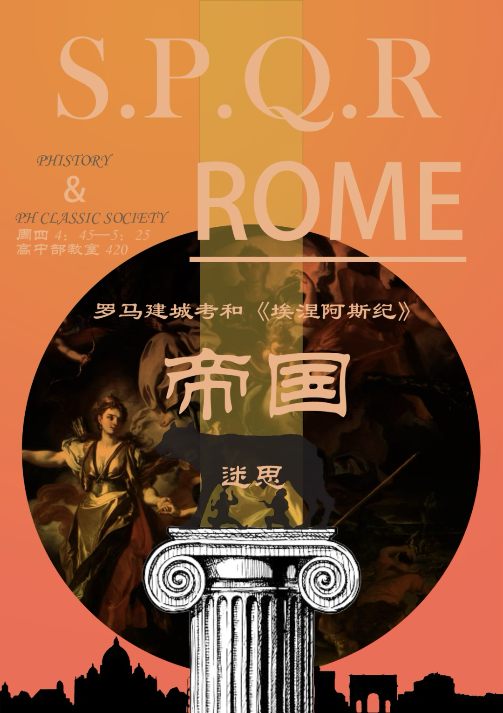
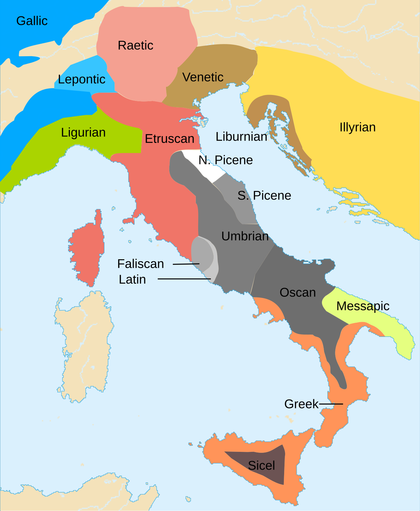
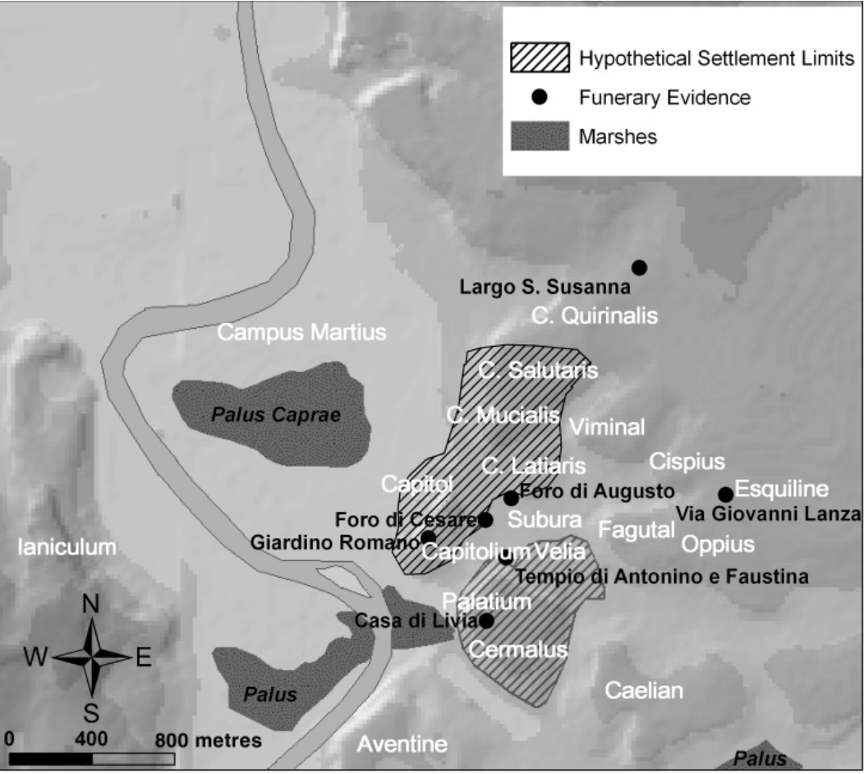
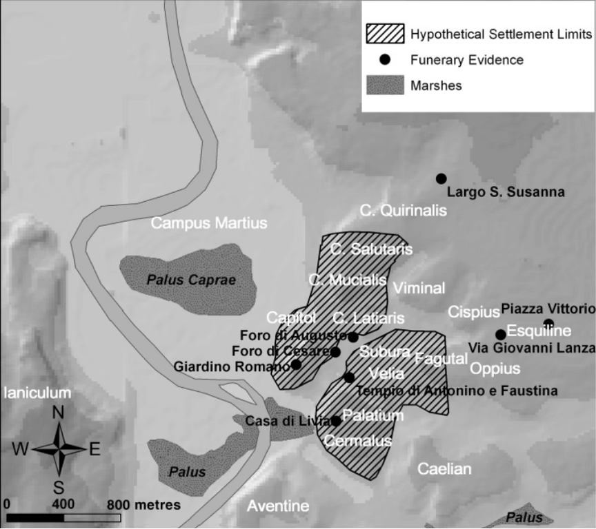
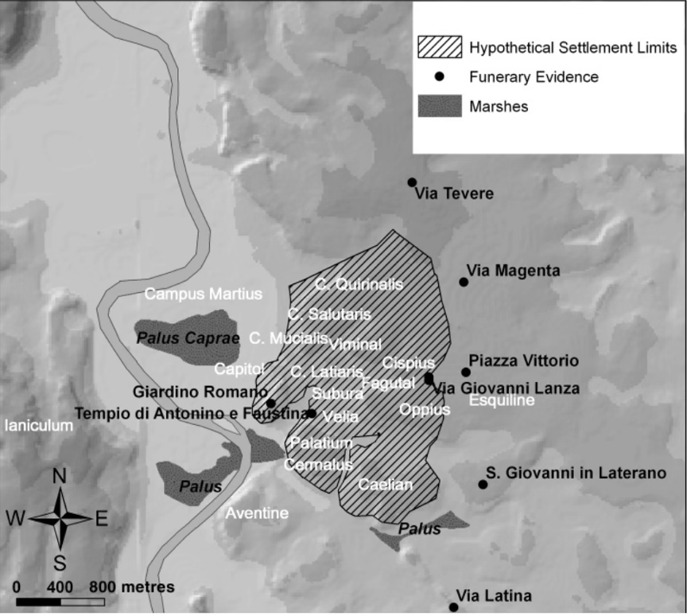

## 帝国的迷思：罗马建城考与埃涅阿斯记

### 传说中的罗马建城
传说中的罗马建城故事，如希腊的埃涅阿斯神话和罗慕路斯与雷穆斯传说，虽然在细节上存在差异，但在这个故事中，罗马的缔造者似乎都与神秘的神祇有着联系。据传说，Rhea Silvia与战神Mars的儿子罗慕路斯与雷穆斯被母狼抚养长大，后来被牧羊人收养。然而，也有一些学者认为，在拉丁语中，“Lupa”既指狼，也指妓女或者狼神的女祭司，因此所谓的“狼”实际上可能是人类。最终，罗慕路斯杀死了雷穆斯和牧羊人，继续建城，并以自己的名字命名这座城市为罗马，成为其第一任国王。

现在被大部分承认的罗马建城日期实际上来自于Marcus Terentius Varro，他认为罗马的建城日期在第六次奥林匹克祭典的第三年（前754-753）。其他古代学者，如Marcus Terentius Varro、Diodorus Siculus、Marcus Porcius Cato、Polybius，也提出自己的看法。根据这些历史学家的研究，罗马的建城大约可以追溯到前850年到前700年之间。

神话传说往往混杂着虚构与现实，因此，对于罗马建城的历史，我们需要依靠更具体的史料和考证。罗马早期的史料主要有年代记（annales），出现在前五世纪中叶由于宗教目的而出现的编年体历史记录。此外也可以参照一些，私人历史记录，贵族家庭内部往往会有年代记录，此外还有名人葬礼时的称颂演说（laudationes funebres）。但遗憾的事，大部分材料都在前390年的高卢入侵中被损毁了，只能借助考古学来了解罗马城的建立。

### 亚平宁半岛上的居民
在深入探讨罗马建城的历史之前，让我们先回顾一下意大利半岛的人种分布和古代居民的迁徙，这些因素共同构成了罗马的多元文化和复杂历史。
古代意大利半岛的人种分布异常复杂，这可以追溯到古代迁徙和部落的多次迁徙。以下是一些关键的部落和文化：
•  北部高卢人部落：这些部落包括因苏不里人、Cen omani凯诺马尼人、Boii波伊人和Senones赛诺奈斯人。它们在意大利北部地区定居，并对该地区的文化和人口产生了影响。
• 东部Veneti未内提人：Veneti是意大利东北部的一个古代部落，他们在该地区建立了自己的文化和社会。
•  Etruria（Tusci）：Etruria位于意大利半岛中部，是一个古老的文明，拥有独特的艺术、语言和文化。这个地区的人民被称为Etruscans。
•  Umbria翁布里亚人：翁布里亚人居住在意大利半岛的中部地区，他们有着自己的语言和文化传统。
•  Oscan奥斯坎人（Samnites萨莫奈人）：奥斯坎人是一个在意大利南部活跃的部落，他们在该地区留下了重要的历史和文化遗产。
•  Messapic梅萨比人：梅萨比人居住在意大利半岛的南部，他们的文化和语言在该地区有一定的影响。
•  Latin拉丁人-faliscan法利斯坎人：拉丁人是意大利半岛上的一个重要部落，他们的语言最终演化为拉丁语，成为罗马帝国的官方语言之一。

Ancient Peoples of Italy

图片来源[wikipedia](https://en.wikipedia.org/wiki/List_of_ancient_peoples_of_Italy)

意大利半岛的多元性可以追溯到公元前2300年左右的青铜时代。在随后的历史中，意大利半岛迎来了两波意大利人的大规模迁徙。

第一波意大利人最早居住在水上村落，后来他们走上陆地，建立了terramare文化。这一文化的特点包括掌握了青铜铸造技术、火葬风俗以及使用带双耳的陶制骨灰罐，时间跨度大约从公元前1700年到公元前1150年。

随后，公元前1000年左右，这些聚落进入铁器时代，形成了维兰诺瓦文化。这是意大利半岛上第一个使用铁器的部落，他们仍然坚持火葬风俗并装骨灰。
 
伊特鲁里亚人的起源也备受关注，他们深刻影响了后世罗马共和国和帝国的文化。对于他们的起源主要有三种说法。第一种是希罗多德提出的，他认为吕底亚人（Lydia）到达了翁布里亚（Umbria），建立了一些城市，最终变成了伊特鲁里亚人，这也是不少当代学者赞同的观点。第二个观点是列斯波斯得赫拉尼克斯（Hellanicus of Lesbos，前490年—前405年希腊历史学家）提出的，他认为希腊最古老的Pelasgians（一切非希腊人）被希腊人驱逐，由亚得里亚海到达波河，成为了伊特鲁里亚人。第三种说法是哈利卡尔纳索斯得狄奥尼修斯（Dionysius of Halicarnassus）提出的，他认为伊特鲁里亚人时意大利土著。

### 考古学证据
考古学的发现表明，公元前10世纪，帕拉丁山上发生了火葬风俗，而附近的Capitoline山和Palatine山成为了最早有人居住的地方。罗马在其早期发展中经历了多次扩张和融合，最终形成了一个大型聚落。以下是不同阶段的图片。

前950-875

前875-825

前670-580

图片来源Rancesca Fulminante, The Urbanization of Rome and Latium Vetus: From the Bronze Age to the Archaic Era (New York: Cambridge University Press, 2013).

### 结论
说了这么多，罗马建城的具体日期仍然没有被确认，城市的建立取决于对城市的定义。如果采用戈登·柴尔德提出的城市革命理论，即城市的建立需要满足以下标准：大型居住区、财富集中、大规模公共建筑、出版物、表演艺术、科学知识、对外贸易、从事非生产劳动的专业人员、阶级社会、以居住区而不是以亲属关系为基础的政治组织，罗马成为城市可能要到共和国时期。如果是某种革命性的突变标志了罗马的建城日期，即短期内的营造行为，可能是罗慕路斯建立Murus Romuli开始算。

总而言之，罗马从来不是一天建成的，是一个长期过程，小规模聚落逐渐聚合，形成一个大型聚落，成为所谓的“城市”，结合瓦罗和考古学的概念，可以将帕拉丁山和卡皮托山上聚落的融合为罗马建城的标志，其日期应当在公元前八世纪中期。