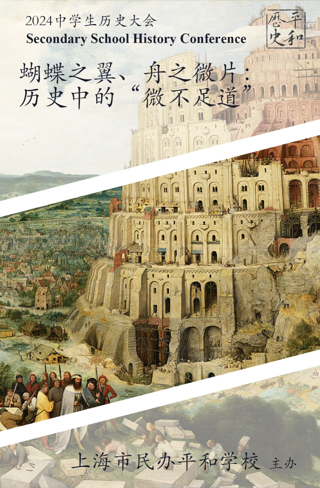
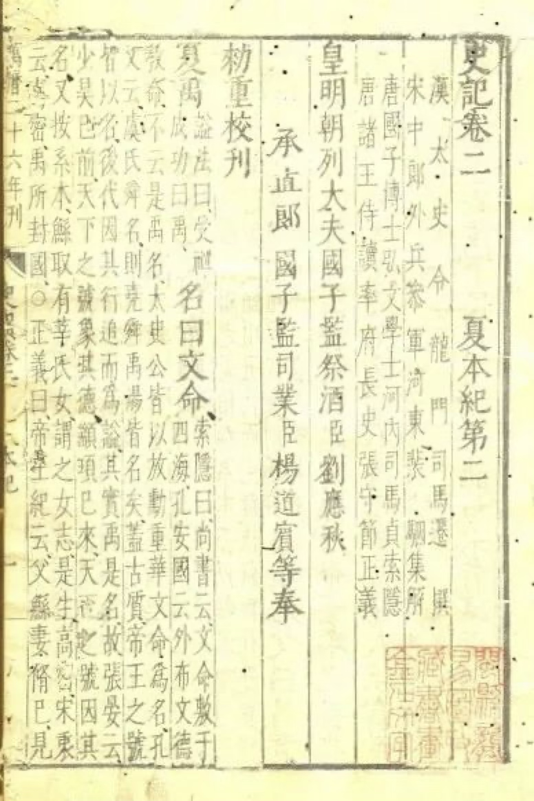
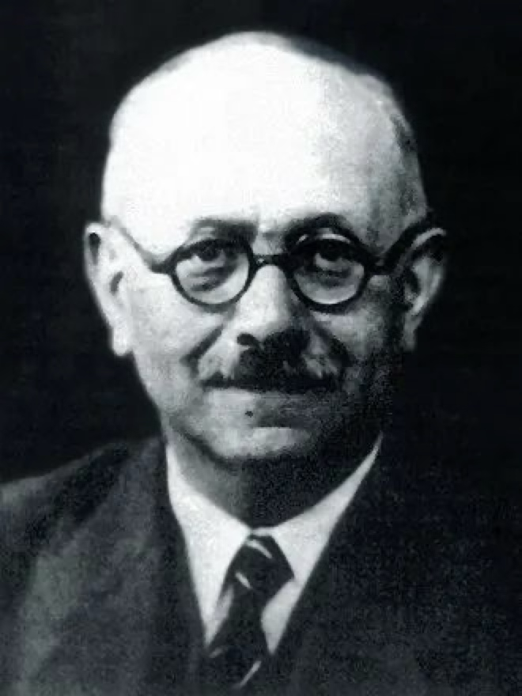
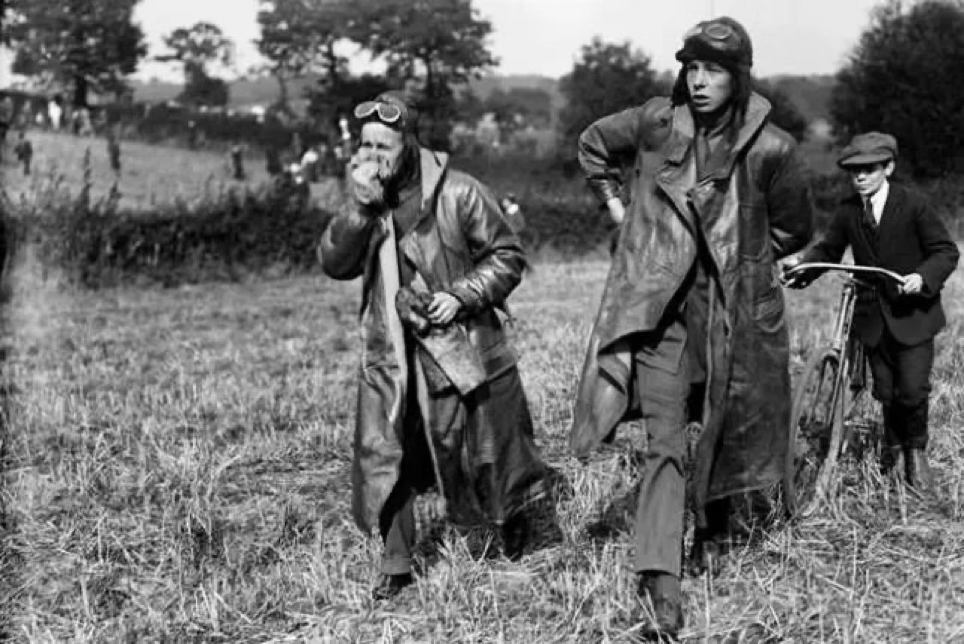
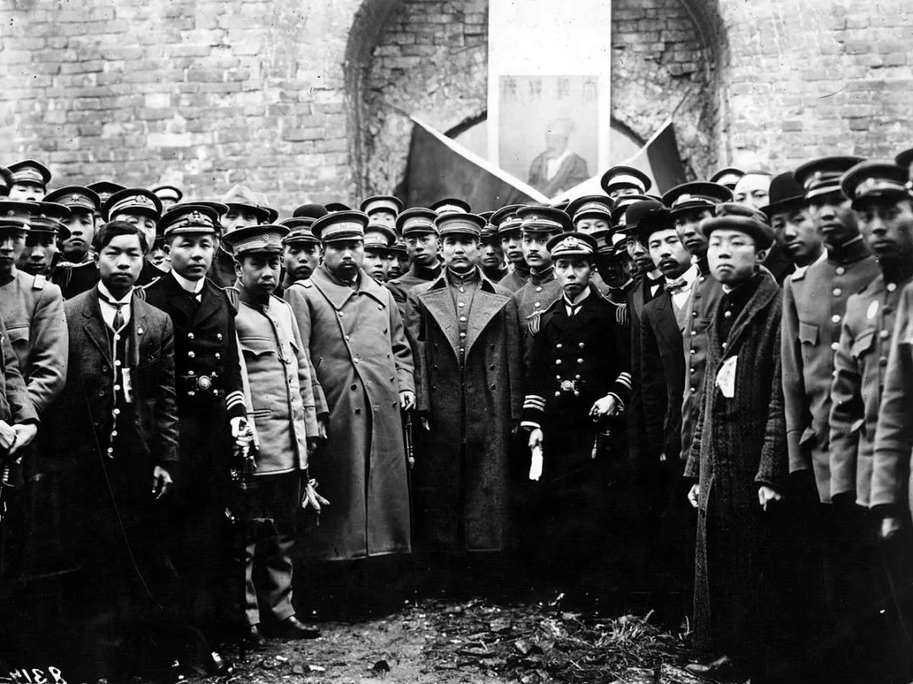

## 第五届历史大会主题简析 —— “ 蝴蝶之翼、舟之微片：历史中的微不足道”

### 主题介绍

论文应根据大会主题"蝴蝶之翼、舟之微片——历史中的“微不足道”为引导进行写作。

请各位将自己的稿件投至中学生历史大会的官方邮箱：sshc111@sina.com

期待各位的佳作！

### 引言
中学生历史大会（SSHC）是一个由平和历史社自主组织和创办的历史社科类学术交流项目。其办会初衷是为全国广大的中学生历史爱好者提供一个宝贵的学术交流平台，集思广益，让热爱历史的学生对历史的见解得到传播，并让参会者得到历史这门学科更新、更深刻的理解。本届（第五届）中学生历史大会（SSHC）的主题为"蝴蝶之翼、舟之微片——历史中的‘微不足道’”。

### 背景
在历史学研究中，我们常常关注**战争、政治变革、伟人传记**等宏大的主题。然而，历史的丰富性也体现在那些看似不起眼的“小事”上，这些小事往往在不经意间影响历史的进程，或者反映出社会的深层次变化。史学史中可以明显发觉这种**由大到小**的研究范式转变。

古希腊和罗马的历史学家，如被誉为“历史之父”的希罗多德（Herodotus）、以其《伯罗奔尼撒战争史》（History of the Peloponnesian War）闻名的修昔底德（Thucydides）、记载罗马共和国崛起的波利比乌斯（Polybius）、以及撰写了罗马史诗般历史的利维（Livy），主要关注重大政治和军事事件以及伟大领袖和人物的传记。

在中世纪，基督教历史学家如撰写《英吉利民族教会史》(Ecclesiastical History of the English People）的贝德神父（Venerable Bede）、《德国编年史》（Chronicles of Germany）的作者奥托·弗莱辛（Otto of Freising）、以及因其关于加洛林王朝年代记而知名的弗罗多阿德（Frodoard），虽然加入了更多社会和宗教主题，但仍然强调重大事件和王朝。

文艺复兴和启蒙时期，人文主义历史学家如弗朗切斯科·瓜恰尔迪尼（Francesco Guicciardini），他撰写的历史着重文学和艺术，以及《路易十四时代》（The Age of Louis XIV）和《风俗论》（Essay on Customs）的作者伏尔泰（Voltaire），开始采取更为世俗化和分析性的方法，不仅仅是编年记事。然而，重点仍然主要是政治、外交和军事历史，例如爱德华·吉本（Edward Gibbon）的《罗马帝国衰亡史》（The History of the Decline and Fall of the Roman Empire）就是一个例证。

19世纪，莱奥波德·冯·兰克（Leopold von Ranke）确立的兰克史学强调严谨的档案研究，正如他在自己的第一本著作《拉丁与条顿民族史》中所说：“历史向来把为了将来的利益而评论过去、教导现在作为自己的任务。对于这样崇高的任务，本书是不敢想望的。它的目的只不过是如实直书而已。”历史作为一门学科成为了拥有系统化研究范式的历史科学（Geschichtswissenschaft）。尽管如此，兰克史学的研究对象仍然囿于政治军事史，而不是“小事”。

中国同样没有基于“小事”的史学传统，对“小事”的记述存在但是多辅助于“大事”。

最早的史书如《尚书》主要记载王室家族历史，注重王朝更迭、君主言行。《春秋》等编年体着眼于纪年和大事记，但亦略及社会风俗。《左传》详备叙事，除国家大事外，也记录了一些民间生活细节。

两汉至隋唐时期，《史记》开创纪传体，虽集中于王朝纪事，但世家、列传部分涉及民间地方事务,可视为由”大”转”小”的进一步实践。《后汉书》等正史中亦有一些关于社会生活、风土人情的记载。此外还出现一些专门记录社会民俗、名人逸事的作品，如《世说新语》、《高僧传》等。

宋元明清时期，正史体例趋于固定，但野史、杂史、地方志等记录社会生活的作品渐多。出现具有较大影响的地理志著作，如《元和郡县图志》、《读史方舆纪要》等，收录丰富的地方民情史料。
族谱一类专著大量出现，反映了对家族宗亲和”小人物”生平的关注。会要、纪事本末体等新体裁作品，注重由"小"见"大"的叙述方式。

到了现代，西方率先出现了基于“小事”的新史学。20世纪初的法国年鉴学派，由马克·布洛克（Marc Bloch）、吕西安·费弗尔（Lucien Febvre）和费尔南·布罗代尔（Fernand Braudel）领军，转向研究塑造历史的长期社会、经济和地理力量，而不仅仅是事件。

20世纪的其他新史学运动，如英国马克思主义历史学家克里斯托弗·希尔（Christopher Hill）和E.P. 汤普森（E.P. Thompson）、"新社会历史"，以及哲学家米歇尔·福柯（Michel Foucault）对“文化转向”的贡献，进一步将重点从传统政治叙述转向社会阶级、性别、种族、文化和边缘群体的历史。通过学者如卡洛·金兹堡（Carlo Ginzburg）和乔瓦尼·莱维（Giovanni Levi）等对小社区和看似微不足道的事件的微观历史研究变得更为常见，揭示了更大历史进程在地方层面的体现。

### 主题分析
具体论文的写作取决于对于“小事”的定义，我们认为，一个可以参考的“小事”定义是在历史学研究中被忽略的某样事物。依照此定义，您论文的写作可以分成从这四个方向中的“小”出发：史料、研究对象、事件和方法论。请注意，以下题目仅仅用做参考，本次大会接受并且欢迎所有符合要求的论文。

史料

史料是历史研究的原始材料，它们是研究者用来重建和解析过去事件的基础证据。史料可以分为两大类：一类是文献史料，包括史书等文字记录；另一类是非文献史料，如考古发掘出的器物等。鉴于本次大会面向高中生，您可以着重关注过去被忽视的文献史料。传统上，历史学家多关注史书作为史料，您可以关注更广泛的史料来源，包括账簿、家谱、杂志、报纸等，这些都能为历史研究提供丰富的视角和信息。

**可能的题目：**   
- *从商业账簿看清朝晚期的经济变迁*   
分析清朝晚期商人使用的账簿，探讨其在经济、社会变化中的作用及意义。  
- *报纸作为社会变革的镜像：20世纪初美国的案例研究*   
通过分析20世纪初美国的报纸报道，研究媒体如何反映并影响了社会的政治和文化变革。  
- *家谱与民俗：探索中国农村的社会结构*  
利用家谱史料，分析中国农村地区的家族结构、传统习俗及其对社会稳定的影响。  
- *日记揭示的历史：安妮·弗兰克日记的个人与历史价值*   
通过分析安妮·弗兰克的日记，探讨个人叙述如何反映二战期间的社会环境和人类情感。   
- *电影票根的故事：20世纪初电影的文化影响*. 
收集并分析早期电影的票根，探讨电影如何影响20世纪初的流行文化和社会习俗。  

研究对象

研究对象是指历史研究中的主要关注焦点，它可以是个人、群体、事件或其他任何具有历史意义的元素。传统历史学往往集中于研究显赫的政治人物、重大的政治事件或宏大的社会变革。然而，正如我们在背景中所介绍的，现代历史学越来越注重”从下向上”的研究视角，试图从这些微观视角解读历史变迁的复杂性。如果您选择这个方向，可以考虑关注普通人、边缘群体和日常生活这种过去被忽视的群体，也可以关注某个被忽视的具体人物。

**可能的题目：**   
- *普通市民的战争体验：民众如何影响和被影响于一战*  
研究普通人在一战中的角色和遭遇，探讨他们如何影响战争及其对他们生活的影响。  
- *当铁匠遇上工业革命：传统手工业者的适应与变迁*    
探索工业革命期间，传统铁匠如何适应新的生产方式，以及这一变化对他们生活的影响。   
- *边缘视角：19世纪美国南部奴隶的日常生活*    
通过日记、信件和其他第一手材料，探讨19世纪美国南部奴隶的生活状况和抵抗形式。    
- *无名英雄：二战中的普通士兵日记分析*    
分析二战期间普通士兵的日记，以了解战时普通人的情感世界和生存状态。   
- *女性在工业革命中的角色和影响*    
研究工业革命时期女性在家庭和工业生产中的角色，探讨她们如何影响社会经济结构的转变。  

事件

在历史研究中，事件指的是在特定时间和地点发生的、具有一定历史影响的行为或变化。事件研究是历史学的一个重要方面，它不仅关注事件本身，还包括事件的前因后果以及其对社会的长远影响。历史学家通过分析事件的多个方面，可以更深入地理解历史进程中的因果关系和复杂交互。因此，您可以考虑研究那些在当时可能看似微不足道但后来证明具有重大意义的事件。

**可能的题目：**    
- *1911年辛亥革命的地方影响：一个小镇的故事*  
研究辛亥革命如何影响中国一个小镇的政治、经济和社会结构。  
- *足球比赛的社会意义：1966年世界杯对英国的影响*   
探讨1966年世界杯如何影响英国的国家认同和社会氛围。   
- *1904-1905年俄日战争对20世纪初亚洲力量结构的影响*  
研究俄日战争的起因、过程及其如何重塑了东亚以及全球大国间的力量平衡。  
- *1932年美国银行危机的前因后果及其对新政的推动作用*   
研究1932年美国银行危机的起因、过程和对美国经济及政策的长远影响。  
- *鸦片战争前后的广州贸易变革*  
通过对鸦片战争前后广州贸易的分析，探讨这一事件如何改变了中国的国际地位及内部经济结构。  

方法论

方法论是指在进行学术研究时所采用的理论框架、方法和技术。在历史学中，方法论不仅包括传统的文本分析、史料解读和史实重构等方法，还包括近年来新兴的数字化方法，如量化分析、计算机辅助文本分析、GIS（地理信息系统）等。这些现代技术的引入使得历史学家能够处理更大规模的数据集，进行更精细的空间和定量分析，从而在传统的叙述历史学之外开辟新的研究路径。您可以考虑尝试使用这种方法进行研究。

**可能的方法：**   
- *历史时间线工具的应用：研究历史事件的互联和影响*  
使用在线时间线工具来系统地展示某个历史事件的前因后果，提高历史事件的可视化和理解。  
- *简单统计在历史研究中的应用：分析战争年代的人口变化*  
利用基础统计方法，研究特定战争期间的人口统计数据，探讨战争对人口结构的长远影响。   
- *数字人文视角下的历史地图分析：以第一次世界大战为例*   
使用GIS技术重构第一次世界大战的战场地图，分析其对战争策略的影响。   
- *计算机辅助文本分析在历史学中的应用：以清朝末年报纸为例*  
利用计算机辅助文本分析技术，研究清朝末年报纸上的政治言论和社会舆论。  
- *量化分析在经济历史研究中的应用：以大萧条为背景*    
运用量化分析方法，研究大萧条期间各种经济政策对美国经济复苏的具体效果和影响。    

政治史

政治史关注国家、政府和政权的演变及其对社会的影响。研究方向可以涉及微观层面的地方政治、非主流政治人物及其活动、被忽略的政治事件等。历史学家可以利用未被充分挖掘的史料，如地方政府文件、私人信件、日记，或应用新兴的数字化方法来解析这些微不足道的政治现象。

**可能的题目：**   
- 地方政府的改革与影响：以民国初期的山东省为例（史料）   
- 计算机辅助文本分析在地方政治研究中的应用：晚清地方官员的奏折分析（方法论）  
- 小事件，大影响：1932年上海的学生运动及其政治后果（事件）   

国际关系史

国际关系史研究国家间的互动与外交政策。可以从小国的外交策略、被忽略的国际会议、次要外交官的角色等角度切入。使用新的史料如外交信函、会议记录，或通过量化分析外交关系的变化，能够揭示隐藏的国际互动模式。

**可能的题目：**   
- 外交信函中的隐秘外交：1919年巴黎和会中的小国声音（史料）  
- 数据分析在国际关系研究中的应用：冷战期间美苏外交电文的文本分析（方法论）   
- 1954年日内瓦会议如何影响越南战争（事件）   

文学史

文学史关注文学作品及其创作背景。研究可以聚焦于被忽略的作家、小众文学作品或特定历史时期的文学社团。通过利用私人手稿、杂志、书信等史料，或应用数字人文技术对文本进行深入分析，可以发现文学史中的微小但重要的变化。

**可能的题目：**   
- 数字人文视角下的文本分析：鲁迅小说中的隐喻与社会批判（方法论）   
- 抗战时期的文学社团“文艺阵线”（研究对象）  
- 1940年代《杂志》对中国现代文学的推动作用（事件）   

科学史

科学史研究科学发展及其社会影响。可以研究被忽视的科学家、实验数据或科学组织。利用实验记录、学术通信等史料，或采用量化分析科学文献的方法，可以揭示科学进步中的微小但关键的要素。

**可能的题目：**    
- 量化分析科学论文：20世纪初期中国科学文献的引用模式（方法论）   
- 数学家华罗庚在战时中国的科研工作（研究对象）  
- 微不足道的实验：1950年代中国科学大会上的关键实验及其后续影响（事件）   

技术史

技术史研究技术发展及其影响。可以从微小的技术发明、地方性的技术应用或被忽视的技术专家入手。通过分析专利文件、地方档案，或使用GIS技术追踪技术扩散路径，可以揭示技术变迁中的细节。

**可能的题目：**   
- 专利文件中的发明：晚清时期中国的小型技术发明（史料）   
- 小技术，大变革：1950年代中国农村的手工织机改革（事件）   

学科史

学科史研究各学科的发展历程。可以考察被忽略的学术会议、小规模的学术争论或非主流的学术作品。利用学术期刊、会议记录，或通过计算机辅助分析学术网络和引用，可以揭示学科发展的微小但重要的推动力。

**可能的题目：**     
- 学术期刊中的争论：19世纪《Nature》杂志优生学学术文章分析（史料）   
- 1970年代美国心理学界的学术引用关系（方法论）   
- 黄侃的语言学研究对现代汉语的贡献（研究对象）   

思想史

思想史研究思想、观念的起源和传播。可以研究被忽视的思想家、小众思想流派或特定时期的思想变迁。通过分析私人手稿、讲座记录，或使用文本分析技术，可以探索思想史中微不足道却关键的细节。

**可能的题目：**    
- 严复手稿研究（史料）   
- 文本分析在思想史中的应用：分析《新青年》杂志中的思想传播（方法论）   
- 微观思想变迁：1930年代中国农村教育改革中的思想斗争（事件）   

经济史

经济史研究经济活动及其社会影响。可以从微观经济活动、地方经济发展或被忽视的经济政策入手。通过分析账簿、税务记录，或采用量化分析方法，可以揭示经济史中的细微变化。

**可能的题目：**   
- 账簿中的经济活动：明清时期江南地区的商业账簿分析（史料）   
- 地方经济的发展：1930年代重庆的工业化进程（研究对象）  
- 微小的经济政策：1940年代国民政府的粮食政策及其影响（事件）   

环境史

环境史研究自然环境与人类社会的互动。可以研究地方性的环境变化、微观的生态系统或被忽略的环境政策。利用环境档案、生态数据，或应用GIS技术，可以揭示环境史中的微小变化。

**可能的题目：**   
- 环境档案中的变化：清代黄河改道对周边环境的影响（史料）  
- 微观生态系统：1950年代北京西山的生态变迁（研究对象）   
- 1960年代中国的植树造林政策及其生态影响（事件）  

文化史

环境史研究自然环境与人类社会的互动。可以研究地方性的环境变化、微观的生态系统或被忽略的环境政策。利用环境档案、生态数据，或应用GIS技术，可以揭示环境史中的微小变化。

**可能的题目：**  
- 环境档案中的变化：清代黄河改道对周边环境的影响（史料）  
- 微观生态系统：1950年代北京西山的生态变迁（研究对象）  
- 1960年代中国的植树造林政策及其生态影响（事件）  

女性史

女性史研究女性的历史角色及其社会影响。可以研究被忽视的女性人物、小规模的女性运动或特定时期的女性生活。通过分析日记、书信，或采用量化分析方法，可以揭示女性史中的细微变化。

**可能的题目：**  
- 日记中的女性生活：清末民初女性日记的社会分析（史料）  
- 量化分析在女性史中的应用：近代中国女性就业数据的统计分析（方法论）  
- 微小的女性运动：1920年代中国的女性教育运动及其影响（事件）  

社会史

研究社会结构、群体活动及其演变。可以从微观社会现象、地方性的社会变迁或被忽视的社会群体入手。通过分析人口普查数据、家庭档案，或应用社会网络分析方法，可以揭示社会史中的细微变化。

**可能的题目：**  
- 人口普查数据中的社会结构：清末北京的家庭结构分析（史料）  
- 近代上海商人网络的变迁（方法论）  
- 被忽视的社会群体：1940年代中国城市中的流动人口（研究对象）  
