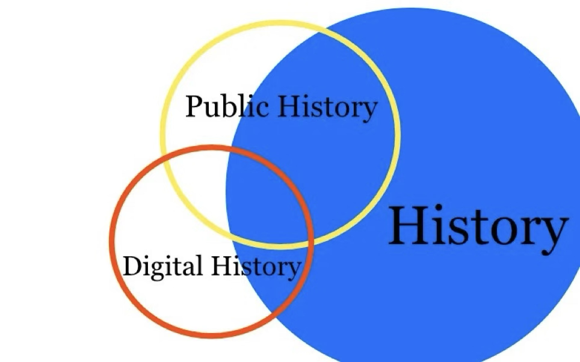

## 什么是数字史学？

数字历史是一门利用数字技术和计算方法来研究、呈现和解释过去的历史的新兴领域，它主要包含：

1. 将过去的历史材料(文献、图像、实物等)数字化
2. 借助计算机等数字工具,对这些数字化资料进行存储、组织、分析、可视化等处理
3. 探讨数字技术对历史认知、表达和传播方式的影响

### 数字史学的历史

数字史学的发展历程跨越了数十年，从最初的尝试到如今的蓬勃发展，数字历史已经成为历史研究中的一支重要力量。
20世纪中期，布萨神父（Roberto Busa）利用打孔卡技术创建圣托马斯作品关键词检索，为数字化处理文本奠定了基础。此后，计算机技术的发展为数字历史的进一步探索提供了可能。到了60年代，计算机开始应用于大数据处理，历史学家开始尝试定量分析，这一学派别被称为计量史学（Cliometrics）。然而，70年代计算历史学一度陷入低谷，受到过于客观主义的批评。换言之，计量史学依赖于大量的数据和算法进行分析和呈现，有时候这种过度依赖可能导致研究者忽略了历史事件背后的复杂性和人文因素。

在IBM工作的布萨神父

到90年代，个人电脑和互联网的普及使得计量史学得以复兴，并出现了一系列开创性项目。21世纪以来，大数据、开源工具等新技术催生了数字历史的新发展，吸收了数字人文的新理念和方法。

### 数字史学和计量史学
数字史学与计量史学有着紧密的联系，都应用定量分析和计算机技术研究历史。然而，它们的重点和方法略有不同。计量历史学更侧重于统计建模、经济计量分析方法，而数字历史则更广泛地应用于文本分析、数据可视化、3D重建等多种数字技术领域。
此外，数字史学部分与公众史学交叉，而计量史学则是纯粹的学术历史，下图可以很好的描述它们的关系

其中计量史学（Cliometrics）应当包含在History类别下，不与Public History和Digital History重合

### 数字史学的优势与局限

数字历史具有许多优势，使其在历史研究中发挥着重要作用。首先，它能够处理大规模的历史数据，发现新的历史模式和规律。例如，Ben Zimmer在他2012年的研究“Bigger, Better Google Ngrams: Brace Yourself for the Power of Grammar”中指出，在1890年左右，人们开始逐渐停止使用"The United States are"，转而开始使用"The United States is"，标志着美国开始逐渐被视为一个整体。
其次，数字技术赋予了新的视角和方法来探究过去，如文本挖掘、关系网络分析等。例如，Roberto Franzosi 在他1998年的论文“Narrative as Data: Linguistic and Statistical Tools for the Quantitative Study of Historical Events”中，通过对报纸进行语义分析，更加准确地推测出意大利红色两年（1919-20, Biennio Rosso）中的罢工数。
再者，通过数字手段更生动形象地还原和展示历史，提高了历史的获得性和体验性。例如，斯坦福大学的ORBIS项目（https://orbis-stanford-edu.translate.goog/?_x_tr_sl=en&_x_tr_tl=zh-CN&_x_tr_hl=zh-CN&_x_tr_pto=sc），其以一种更加具有互动性的方式展现出了罗马帝国时期的地图以及各城市的可达性。
然而，数字历史也存在一些局限，比如依赖已数字化的有限历史材料，难以全面覆盖。同时，过于机械的计算分析可能导致对历史事实的简单化。数字史学需要历史学家掌握新的计算技能，成为所谓的“会编程的历史学家”，历史学和其他学科的跨学科壁垒有待突破。

### 本公众号的未来计划

本公众号未来发表的内容将主要分成两类：第一类是转载和翻译数字史学（以及量化史学）相关的论文；第二类是采访，我将会采访大量对象，并且在过程中广泛科普这一历史流派，采访的对象包括但不限于相关学者、不相关学者、学生、老师等。

### 参考文献

Salmi, H. (2020). What is Digital History?. Britain: Polity Press.
Graham, S., Milligan, I., Weingart, S. B., Martin, K. (2022). Exploring Big Historical Data: The Historian's Macroscope (Second Edition). Singapore: World Scientific Publishing Company.