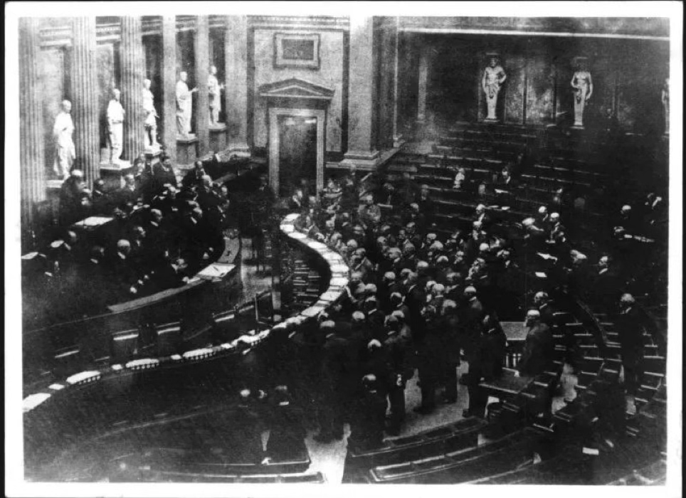
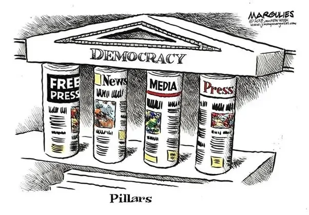
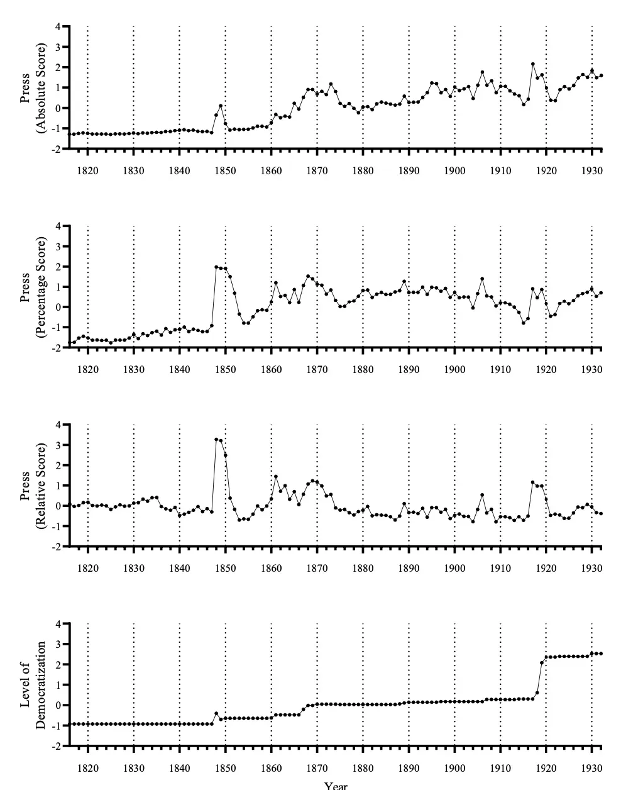

## 媒体与民主化：从宏观长远角度看新闻在民主过渡时期的作用

19世纪的奥地利帝国委员会（Reichscrat）

***

1816年，奥地利是欧洲大陆的主要强国之一，由哈布斯堡王朝统治。这一时期经历了多个重大事件，包括1848年革命和1867年奥匈帝国的建立。当时的统治体制以专制君主制为主。第一次世界大战（1914-1918）导致哈布斯堡帝国解体。1918年11月，随着查理一世退位，哈布斯堡王朝的统治宣告结束。同年11月12日，奥地利共和国正式成立，标志着国家从君主制向共和制的转变。在这116年间，奥地利经历了从专制统治向民主政体的渐进式转型，逐步引入了普选制和议会制度等民主元素。近期，维也纳大学副教授Florian Arendt的论文 The Media and Democratization: A Long-Term Macro-Level Perspective on the Role of the Press During a Democratic Transition 对此进行了探讨，该论文分析了媒体在奥地利民主化进程中所扮演的角色。Arendt教授专注于健康传播领域，他的研究涉及媒体在健康领域的作用，并探讨了包括公共卫生宣传、健康相关新闻质量和新数字媒体技术对健康的影响等多个方面。

Assoz. Prof. Mag. Dr. Florian Arendt

***

### 原文摘要

媒体被认为在民主化过程中扮演着关键角色。目前关于媒体在民主过渡中的作用的现有证据大多基于比较和全球视角，集中在最近的一些关键政治事件上。虽然民主化被概念化为一个长期的过程，但纵向证据有限。本文以奥地利为研究对象，采用从1816年到1932年的长期宏观视角，包括从专制统治（君主制）向民主（共和国）的过渡。基于先前关于示范效应的研究，我们探讨了新闻媒体是否对民主化进程有所贡献。使用对维也纳媒体的内容分析数据，我们评估了整个观察期间每年媒体对民主理念的关注度：媒体对自由和平等等民主理念的报道程度如何？我们使用三个可用的纵向民主化指标来评估民主化水平。为了考虑时间序列中的自相关性和趋势，我们使用自回归积分滑动平均(ARIMA)模型。结果显示，媒体对民主理念的关注度增加与民主化水平的增加之间存在协变关系。此外，我们发现某一年媒体对民主理念的高关注度“格兰杰因果”（即前瞻性预测）未来民主化水平的提高。尽管我们承认在因果解释方面的局限性，但这些发现与长期宏观层面媒体效应的观点是一致的。

媒体与民主

***

### 问题的提出

媒体被认为在民主化过程中扮演关键角色，但现有证据大多基于比较和全球视角，关注的是近期的政治事件。尽管民主化被概念化为一个长期过程，现有的纵向证据却非常有限。大多数关于媒体在民主化中的作用的研究都集中在特定的、近期的政治变化，如后共产主义的中东欧、拉丁美洲、中东、北非和撒哈拉以南非洲、东亚等地区。这些研究通常定义民主化过程为几天、几周、几个月，或最多几年内的变化。对于许多今天已经建立的民主国家来说，民主转型是一个更长的过程，涉及数十年甚至几个世纪的变化。之前的研究（如Jebril et al., 2013）强调需要更多的纵向研究设计，例如时间序列分析，以更好地理解媒体在民主化过程中的长期作用。

Jebril, N., Stetka, V., & Loveless, M. (2013). [Media and democratisation: What is known about the role of mass media in transitions to democracy](https://reutersinstitute.politics.ox.ac.uk/sites/default/files/2017-11/Media%20and%20Democratisation.pdf). University of Oxford: Reuters Institute for the Study of Journalism. 

### 论点与创新点

论文作者认为，媒体在长时间跨度内通过报道民主理念（如自由和平等）可能对民主化进程产生重要影响。研究主要聚焦于奥地利，从1816年到1932年的观察期，包括从专制统治（哈布斯堡君主制）到民主（第一共和国）的过渡。研究基于演示效应（Demonstration effect）（Huntington, 1991；Voltmer & Rawnsley, 2019）的理论，探讨了媒体中民主理念的显著性与民主化之间的相互作用。

Huntington, S. (1991). Democracy’s third wave. Journal of Democracy, 2(2), 12-34. https://doi.org/10.1353/jod.1991.0016

Voltmer, K., & Rawnsley, G. (2019). The media. In C. Haerpfer, P. Bernhagen, C. Welzel, & R. F. Inglehart (Eds.), Democratization (pp. 239–252). Oxford University Press.

### 方法论

论文使用了纵向时间序列的方法来研究民主化这一话题，其构建了民主理念在媒体中的显著性与政治体系民主化两个时间序列，通过检验两个时间序列的因果关系，得出先前所提的结论。

对于第一个时间序列，即民主理念在媒体中的显著性，论文分析了1816年到1932年间在维也纳出版的报纸，评估了四个关键词的报道频率：自由（Freiheit）、平等（Gleichheit）、民主（Demokratie）和选举（Wahlen）。这些关键词反映了民主理念。

其具体的测量方法如下：

1. 绝对得分：统计每年每个关键词在报纸中的出现次数，产生四个时间序列：

   | 关键词 | 平均每年出现次数 | 标准差 | 范围 |
   |--------|-------------------|--------|------|
   | 自由   | 1779.68           | 1209.60| 409-4201 |
   | 平等   | 310.47            | 223.68 | 20-1076 |
   | 民主   | 370.90            | 445.90 | 0-2376 |
   | 选举   | 1499.99           | 1108.65| 49-3406 |

2. 百分比得分：将每年每个关键词的出现次数除以该年报纸总期数，以百分比表示。总期数通过搜索字母“a”的出现次数来估算。结果产生四个百分比时间序列：

   | 关键词 | 平均百分比 | 标准差 | 范围 |
   |--------|------------|--------|------|
   | 自由   | 51.50%     | 21.36% | 10.68%-94.40% |
   | 平等   | 9.21%      | 4.30%  | 1.98%-24.62% |
   | 民主   | 9.16%      | 8.11%  | 0.00%-37.12% |
   | 选举   | 42.12%     | 20.82% | 4.81%-73.43% |

3. 相对得分：考虑报纸长度的变化，通过对比与民主无关的关键词（如音乐、木材、太阳、桌子）的出现频率，调整民主关键词的显著性。结果产生四个对照词时间序列：

   | 关键词 | 平均百分比 | 标准差 | 范围 |
   |--------|------------|--------|------|
   | 音乐   | 59.39%     | 22.15% | 18.70%-86.31% |
   | 木材   | 46.78%     | 12.44% | 22.93%-81.66% |
   | 太阳   | 41.40%     | 16.73% | 10.41%-71.28% |
   | 桌子   | 39.97%     | 16.17% | 12.42%-65.98% |

对于第二个时间序列，即民主化指标论文使用了三个主要的民主化测量方法：

1. Vanhanen指数：基于选举结果，衡量竞争和参与程度。

2. Polity 5指数：基于历史文献，如宪法，衡量制度性民主和专制特征。

3. V-Dem公民自由指数：评估公民自由的尊重程度。

通过主成分分析（PCA），论文将这三个指标合并成一个综合的民主化指数。

为了测试民主理念在媒体中的显著性与民主化之间的关系，论文使用了自回归积分滑动平均（ARIMA）模型。ARIMA模型的结果显示，在控制自相关和趋势后，媒体中民主理念的显著性确实与政治体系的民主化水平存在显著的共变关系。这意味着媒体对民主理念的关注度与民主化水平之间存在统计上的关联。

论文所构建的时间序列

***

### 总结

论文还使用了Granger因果关系测试，以确定媒体中民主理念的显著性是否能够预测未来的民主化水平。这个测试的关键在于确定因果关系的时间顺序，即民主理念的显著性是否先于民主化变化。Granger因果关系测试结果表明，媒体中民主理念的显著性在时间上领先于政治体系的民主化变化。这意味着媒体对民主理念的显著性在一个时间点的增加可以预测未来一段时间内民主化水平的提高。

· · · 数字史学科普 · · ·

本公众号发表的内容将主要分成三类：第一类是转载和翻译数字史学（以及量化史学）相关的论文；第二类是采访，我将会采访大量对象，并且在过程中广泛科普这一历史流派，采访的对象包括但不限于相关学者、不相关学者、学生、老师等；第三类是一些学科科普文章，包含量化方法，史学史等。

