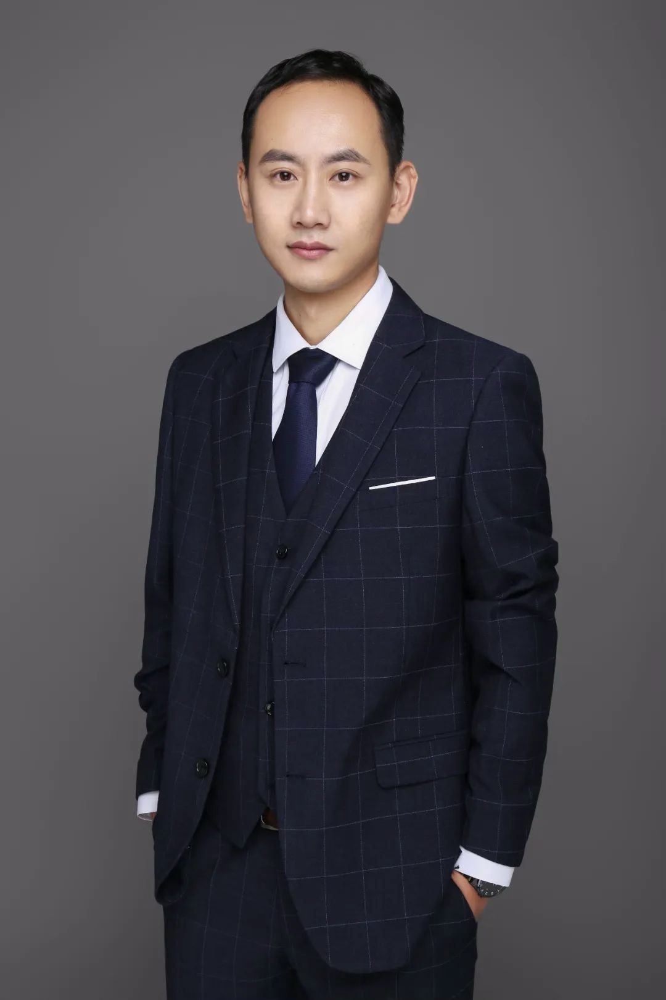

## 人物访谈系列：上海交通大学赵思渊教授

本期推送上海交通大学赵思渊教授访谈内容，在这期推文中，赵教授将为我们揭示他选择历史学这条道路的原因，分享他当前的研究项目，并探讨历史学作为一个研究领域所面临的挑战。无论您是历史学专业的学生、学者，还是对历史研究感兴趣的读者，相信赵教授的观点都将给您带来新的启发和思考。

赵思渊教授是上海交通大学人文学院历史系教授，2012年获华东师范大学思勉人文高等研究院历史学博士学位，同年加入上海交通大学，历任博士后、讲师、副教授，现为教授。赵老师的研究领域包括社会经济史、明清赋役制度史、江南区域史和数字人文。主要研究课题涉及土地制度、赋税征收、地方治理等，研究时段主要集中在明清至民国时期，地域集中在江南地区。他在《中国社会科学》、《历史研究》、《中国经济史研究》等期刊发表多篇论文，主要著作包括《石仓契约》第四辑(合编)。赵老师参与开发了《中国地方历史文献数据库》，并发表相关研究成果。

**Q:**. 
*您能否分享一下您是如何走上历史研究这条道路的？您的学术经历对您的研究方向有什么影响？*

   这个问题很有意思。首先，有一个基本的共识，不仅在中国，在英语世界也是如此：选择历史学专业通常是出于超越功利的原因。如果从职业生涯的回报角度来看，历史学可能不是一个高性价比的专业。但是，它在个人体验和人生感悟方面能带来其他专业可能无法提供的东西。如果你特别喜欢思考某一类问题，或者必须思考这类问题才能获得对自己人生的安定感和确定性，那么历史学是一个值得学习的专业。

   具体到我自己，原因也类似。我本科学的是生物学。20年前有一种说法，”21世纪是生物的世纪"，很多人因此选择了生物技术或生物学专业。我认为生物学专业还是很好的，因为它今天仍然展现出巨大的活力，有很多重要的话题，在科研方面还有很大的空间。

   当时我觉得生物学这类学科能解决你对自然世界的很多疑问，但不太能解决你面对所处社会的诸多疑问。所以还是要看你自己的长期职业生涯想要回答什么样的问题。有些人可能会注重如何获得更好的生活，有些人可能追求长期的职业回报，还有一些人有更强的好奇心探索这个社会是什么样子。不同的专业知识会回答不同的问题。

   我在年轻的时候对最后那一类问题有很多困惑。我想找到一个能够回应这些困惑的职业发展路径，所以就来到了历史学这个领域。就这样坚持下来了。

**Q:**  
*接下来我想请教一下您目前的研究状况，可以介绍一下您现在进行的一些研究项目或者过去的项目吗？* 

   我先从一个总体的角度来讲。历史学主要关注某些类型的问题，其中最主要的一类问题就是社会是如何发生变化的。历史学当然是关于时间的，我们关心社会在时间中如何发生变化。我自己特别关注的是经济领域的变化。

   现代社会和传统社会的根本区别之一就是经济模式的不同。我们通常认为现代社会在某种意义上是一个市场经济的社会，是一个工业化的社会，而传统社会则大多不是这样。因此，一个重要的问题就是：这个变化是如何发生的？在这个根本性变化发生之前的社会是什么样子，它是如何变成现在这样的？这就是我关心的问题类型。

   如果以欧洲为参照，从16到19世纪，市场体系的建立和工业化的过程有一个比较明晰的线索。但关于中国在16到19世纪发生了什么，学界有很多辩论。不同时代、不同政治光谱、不同学术理念的学者对这个问题的看法不仅不一样，甚至是针锋相对的。这对我来说是有趣的。

   我最近5-6年的研究兴趣特别聚焦在18世纪。18世纪很微妙，因为19世纪中国的历史走向已经很清晰了，必须面对所谓的现代性问题。但18世纪并非如此，你能看到很多错综复杂的历史可能性。

   近年来中国经济史领域的很多研究都在讨论，我们在18世纪的中国社会发展中能观察到很多市场经济的因素。虽然工业化还没有起步，没有出现像英格兰那样的大规模工业生产。但公平地说，整个18世纪的欧洲，除了英格兰，也没有多少地方发生了那种大规模的工业生产。因此，18世纪中国的经济模式是一个很有趣的研究对象。如果我们将它放在同时代的欧洲、北美、南亚、东南亚、中东这些主要的大规模经济体中进行比较研究，你会发现各个地区都有各自的优势和劣势。即使以现代经济的“后见之明”来看，每个地区都有其独特之处，这本身就是一个很有趣的研究课题。

**Q:** 
*从更宏观的角度来看，历史学作为一个研究领域是否面临一些主要挑战？这些挑战会如何影响这门学科的未来？*

   这是一个很好的问题。一个基本的前提是，广义上的人文学科，文学、历史学、哲学等等，存在一些在任何时代都必须不断回应的基本问题。比如人如何成为人，我们从哪儿来，未来将如何，等等。这些问题从柏拉图与孔子的时代到现在，没有根本性的变化。这和自然科学的确是不太一样的。自然科学追求不断创造新的知识。
但另一方面，现代的人文学术体系和自然科学一样，都在17世纪之后经历了非常显著的变化。其中比较重要的变化可能是实证检验的方法成为学术研究的核心方法。这在欧洲科学史中有很多故事，不必多说了。即使在中国，18世纪的汉学家，例如阎若遽等人用实证方法证实古文《尚书》是所谓“伪书”，也是学术方法上的巨大变化。所以从梁启超到艾尔曼（Benjamin Elman）都高度重视这其中所包含的思想方法的积极变化。

   现代学术研究，不论是自然科学还是人文学科，都要求提出研究问题，然后对这个问题进行尽可能的检验。不同的是，历史学中问题的变化不像自然科学那么快速和剧烈。

   如果问历史学的核心能力是什么，我认为是对史料的处理能力。历史学对人类社会的贡献有几个层面：首先，历史学为整个人类社会传承有关过去的知识和记忆。其次，历史学提供了一整套方法论，用于处理所有人类社会保留下来的文献资料，特别是文本资料。

   历史学家的核心能力在于能够最好地辨别过去留下的文字材料到底说了什么，因为字面意思和实际意思往往有很大差别。因此，史料学是历史学中的核心能力。最优秀的历史学家在这方面都有独到的贡献和见解。

   除了讲述历史故事或进行特定历史研究外，优秀的历史学家还需要在史料处理方面有独特的见解。比如，研究二战史的学者需要对档案处理有独到见解，研究古典时代的学者需要对特定文本（如圣经）有深入理解，研究早期近代经济史的学者则需要能够准确解读当时的账本或契约。这种对特定时代和类型文献的深入理解和解读能力，是历史学家的核心竞争力。

**Q:**  
*对于一些比较新的统计分析或计量经济学方法，您有什么看法？这些方法会不会改变历史研究？*

   这是一个非常好的问题，也是当前历史研究领域正在热烈讨论的话题。我的看法主要有三个层面：

   第一个层面，我是积极拥抱这些新方法的。作为一名经济史研究者，量化研究对我们来说是必不可少的。这一趋势其实可以追溯到1970年代，以罗伯特·福格尔(Robert Fogel)为代表的一代学者开始推动量化历史研究。他们之所以能够开展这样的研究，很大程度上得益于当时技术的进步，特别是大型计算机的出现。

   在计算机出现之前，历史学家主要依赖手工计算，这种方式的效率可能还不如传统的描述性资料分析。但有了大型计算机后，情况就完全不同了。我们可以处理大规模的统计资料，这使得我们能够以前所未有的方式来观察历史进程，揭示出仅靠描述性文字难以呈现的历史层面。

   随着计算能力的不断提高，量化历史研究的方法也在不断演进。今天，我们看到越来越多的量化历史研究（quantitative history study）正在进行。同时也有越来越多的经济学家参与到这个领域中，他们当然对数学模型更为熟悉，使用模型分析数据方面更加得心应手。

   我对这种跨学科的研究方法持开放态度。我认为，用不同的方法来讨论同一个历史话题是很有价值的。这种多元化的研究方法可以帮助我们从不同角度理解历史，发现新的洞见。

   第二个层面，作为一个历史学家，我更关注数据本身的性质和来源。这就是我们所说的史料学工作，也是历史学家的核心技能。在我们急于用这些数据进行计算之前，我们首先要问的问题是：这些数据是如何被收集的？它们是通过什么途径来到我们面前的？它们的背后可能隐藏着什么样的偏见或局限性？

   如果我们认真追究，会发现历史上留下来的统计数字往往都存在一些问题。甚至在社会科学领域，也有一种说法是”统计会骗人"。只要通过某种特定的统计方法，你几乎可以得到任何你想要的结果。就拿现今的官方统计数据来说，我们也常常需要对其保持谨慎和批判的态度。

   因此，历史学家在使用数据时通常会比经济学家更加犹豫和谨慎。我们会花大量时间去了解各类统计数字的性质和局限性，然后才会考虑如何使用这些数据进行计算和分析。有时候，在完成这第一步的审慎考察后，我们可能会发现这些数据存在太多问题，以至于难以用于进一步的量化分析。
相比之下，经济学家可能会更倾向于先进行计算和模型分析，然后再回过头来讨论数据本身的问题。这种方法论上的差异有时会导致历史学家和经济学家之间产生分歧。但我认为这种学科之间的争论和对话其实是很健康的，它能推动我们对研究方法进行更深入的思考。

   第三个层面，我们要认识到技术是在不断进步的。未来的计算能力肯定会比现在更加强大。这就引发了一个有趣的问题：当我们拥有了超强的计算能力时，我们现在使用的这些模型和方法是否还有意义？

   这让我想到了人工智能领域的发展。当研究者发现，通过使用足够多的计算资源，就能构建出一个能够自我学习、理解语义的大型语言模型时，之前那些精巧的符号学派的语法构建方法似乎就变得不那么重要了。

   我不确定在历史研究领域是否也会发生类似的范式转移。也许在未来的几年或者十年内，我们就会面临这样的问题：今天我们苦心研究的那些统计模型是否还有用？当然，这只是一种猜测。无论如何，这种技术的快速发展肯定会给我们的研究方法带来深刻的影响，我们需要保持开放和警醒的态度来应对这些变化。

**Q:**  
*您开发了中国地方历史文献数据库。您认为这个数据库有什么意义？作为一个历史学家开发这样一个数据库，在过程中是否遇到了某些挑战？*

    这是个好问题。首先我要说，这个数据库是10年前开发的，现在来看确实有点过时了。过时的原因很简单：现在的技术已经发展到只要有史料的全部文本，我们就可以对它随意做标记，甚至可以把它输入大语言模型进行训练和识别，从而进行各种分析。在这个层面上，我们当初设计的结构化数据库确实显得过时了。

    当年我们设计这个数据库时，还是按照一个结构化的方法，试图从史料中提取一些结构性特征，使这些特征变得可以进行统计分析。但按照今天的计算机算力和人工智能模型，这一步工作是可以跳过的。

    尽管如此，这些工作仍然是有意义的。原因在于，识别出不同类型的史料应该按照什么样的结构性特征去理解，这本身就是一个必须要做的工作。假设有一个从未读过这些契约文书的人开始阅读，然后让他立即进行统计分析，他很可能会感到茫然，陷入到我们常说的”史料的海洋"中而迷失方向。

    一个结构化数据库的优势在于，它可以快速帮助使用者理解这个资料是什么。因为它给出了提示，告诉你这是什么类型的资料，那是什么类型的资料，以及它们有哪些基本元素是你需要注意的。当然，如果你是一个熟悉这些资料的专家，你可能就不需要借助这个结构，可以按照自己的想法去做统计分析。

    关于开发过程中遇到的挑战，我必须说我没有遇到太大的障碍。我比较了解如何与计算机工程师沟通，知道他们需要什么信息。我不需要关心具体的代码实现，但我需要告诉他们前端界面应该是什么样子，让他们去思考如何用代码实现这个界面。

    这个项目得以顺利进行有一个重要前提，就是我在此之前已经对这些材料进行了多年的整理。我从2012年开始接手这个工作，当时这些材料还是装在一个个麻袋里。我从最基础的整理开始，一件件拿出来查看。面对20多万甚至30万件这样的文献，我开始思考如何建立数据库才能很好地呈现这些资料，让其他人能够方便地使用。

   在这个过程中，我主要依靠了两点前人的智慧：
契约文书在我们经济史领域是从1930年代就开始研究的史料类型。前辈们从那时就开始研究这些材料，告诉我们后人它们是什么，里面的文字表述意味着什么。我继承了这些知识，很快就知道哪些结构性特征是需要提取出来的。
2009年，台湾已经有学者做过类似的数据库。我们从中吸取了很多经验。其中最重要的一点就是历史学家与计算机工程师如何合作。我当时拜访了台大资讯工程系的项洁教授，他主持开发了THDH（台湾数位历史图书馆），他向我分享了很多经验和教训，包括他们当时与历史学家有过哪些分歧。这都帮助我在后来的工作中避免了一些潜在的问题。
    
   总的来说，我认为我们都是在前人基础上一点点往前走，每个人做一小步的工作。这个数据库虽然现在看来有些过时，
但它在当时确实发挥了重要作用，也为今后的研究奠定了基础。

**Q:**    
*对于未来想认真研究历史的年轻人，您有什么具体建议吗?有哪些基本技能需要掌握?*

    坦白说，我不太愿意给年轻人建议。我认为你们这一代人的基础知识和视野已经比我们那一代要好得多。在交大教学术写作时，我每年看学生的作业都感叹，自己大一时根本写不出这么好的作品。我百分之百相信你们比我们强得多。

    不过，如果一定要给建议的话，我会说:你不一定非要专门学习历史专业，也可以选择其他专业，把历史作为兴趣爱好来研究。客观来说，这个世界不需要太多历史学家，但也绝对不能没有历史学家。因为一个没有历史传承的社会是非常可怕的。做历史传承这件事对社会来说很重要，但不需要太多人参与，有一些就足够了。

    如果你真的决定学习历史，我想跟你分享一位我很尊重的前辈学者陈春声的观点。他曾用一个家庭的比喻来解释历史学的作用:如果你邀请客人到家里做客，你会带他们到客厅，向他们介绍墙上的字画，而不会首先介绍厨房和厕所。不过我们自己在家里用的最多的可能是厨房和厕所。

    根据我的经验，我建议在本科阶段不要给自己设定太具体的目标。但我也意识到，对你们这一代人来说，不论是在国内还是国外读书，做到这一点都很困难。因为现在的高等教育体系，无论是欧美还是中国，都过于注重具体、指标化的绩效。每个教育体系都有一个"清单"，学生们在本科阶段都要努力填满这个清单。我对这种现状很不满意，这是我对当今全球高等教育失望的一个重要原因。但是，作为学生，你很难靠自己的力量改变这个系统。所以你还是得先适应这个体系，在此基础上尽量进行一些没有强烈目的性的探索。

    特别是对于历史学这个领域，我认为它非常依赖个人的阅历。你对这个世界的理解越复杂，就越能深刻理解历史。当我们阅读史料的时候，是在和过去的人对话，他们和我们有非常不同的人生经验，其中很多人比我们更聪明，有更强的影响力。要在他们“说了什么”之外理解他们“为什么这样说”，并不是容易的事。
这是开始历史研究时常常会面对的困难，如果我们只是复述史料中说了什么，这样的历史研究很难对当代人有启发。
好的历史学者会在读到这些故事时不断提问:为什么会是这样?还有什么隐藏的原因?

    这种能力是可以通过训练获得的，好的历史学教学体系会提供这样的训练。但同时，它也需要你在日常生活中积累各种看似无关但有趣的经历和知识。当这些积累足够多时，你再回过头来看那些历史故事，就会发现很多别人没有注意到的问题和角度。这就是成为一个优秀历史学者的过程。

    你们可以把这些当做前人的经验，也可以把它们当做你们要挑战的东西，我觉得后者会更好。最后我想讲一个故事，虽然这可能有点说教的意味，但我认为很有启发性。这也是我的前辈老师告诉我的。

    有一个物理学界的老前辈叫高锟，他因为在光纤技术方面的贡献获得了诺贝尔奖。在2000年代初的时候，光纤技术还方兴未艾。有人问高锟，他觉得光纤技术的未来会怎么样？高锟回答说：”如果你问我，我认为光纤技术就是全世界最好的通信技术，不会有比这再好的技术了。"这是第一句话。第二句话是："但是你千万不要相信我，因为我本来也不相信我的那些前辈，所以我才能做出光纤技术来。"

    我希望你们能以这种态度来看待我们今天讨论的观点，不要盲目接受，而是去挑战它们。这样才能激发创新，推动进步。

· · · 数字史学科普 · · ·

本公众号发表的内容将主要分成三类：第一类是转载和翻译数字史学（以及量化史学）相关的论文；第二类是采访，我将会采访大量对象，并且在过程中广泛科普这一历史流派，采访的对象包括但不限于相关学者、不相关学者、学生、老师等；第三类是一些学科科普文章，包含量化方法，史学史等。

