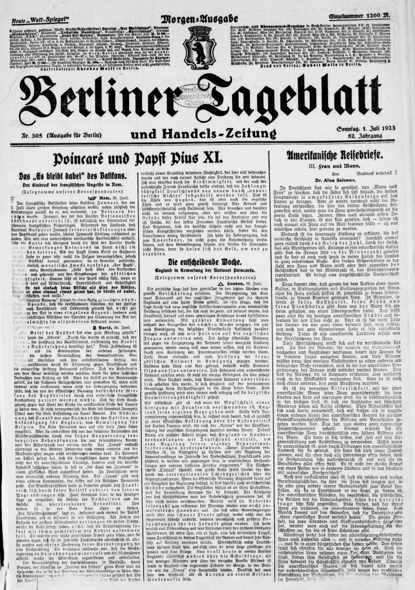
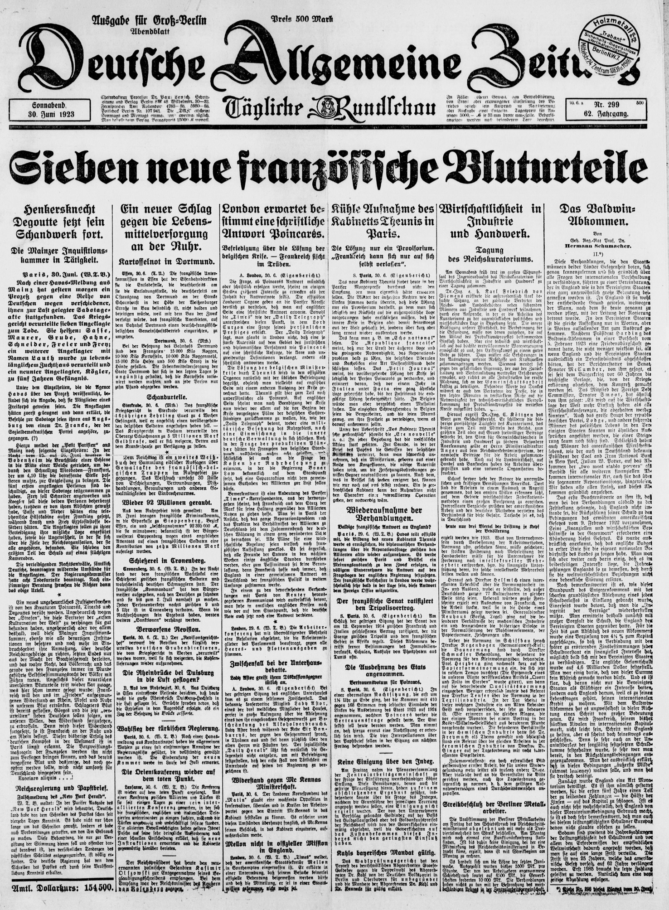
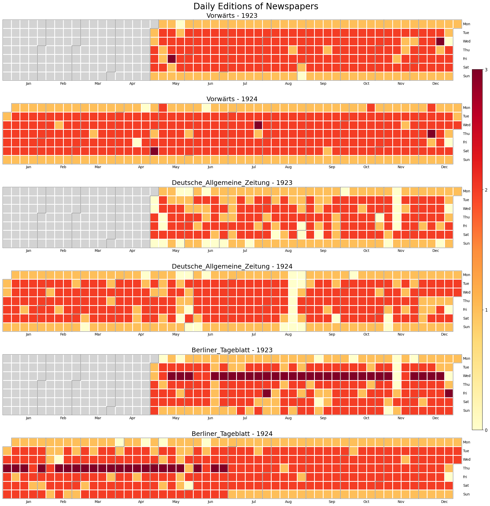
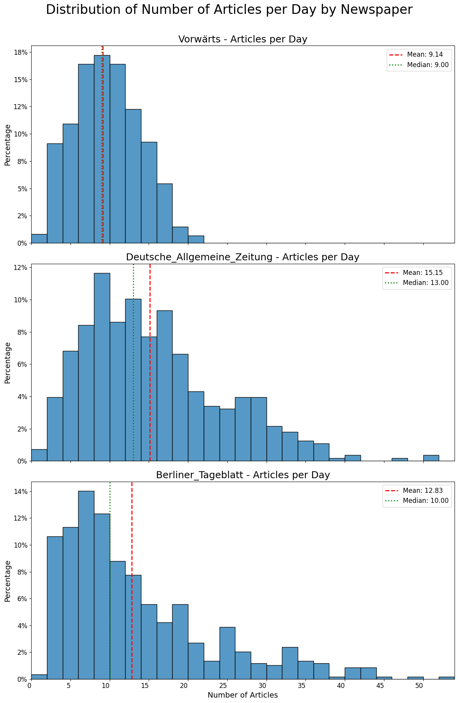
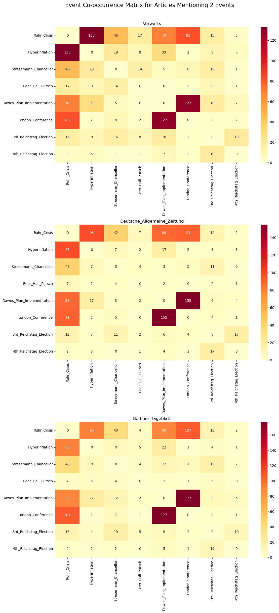
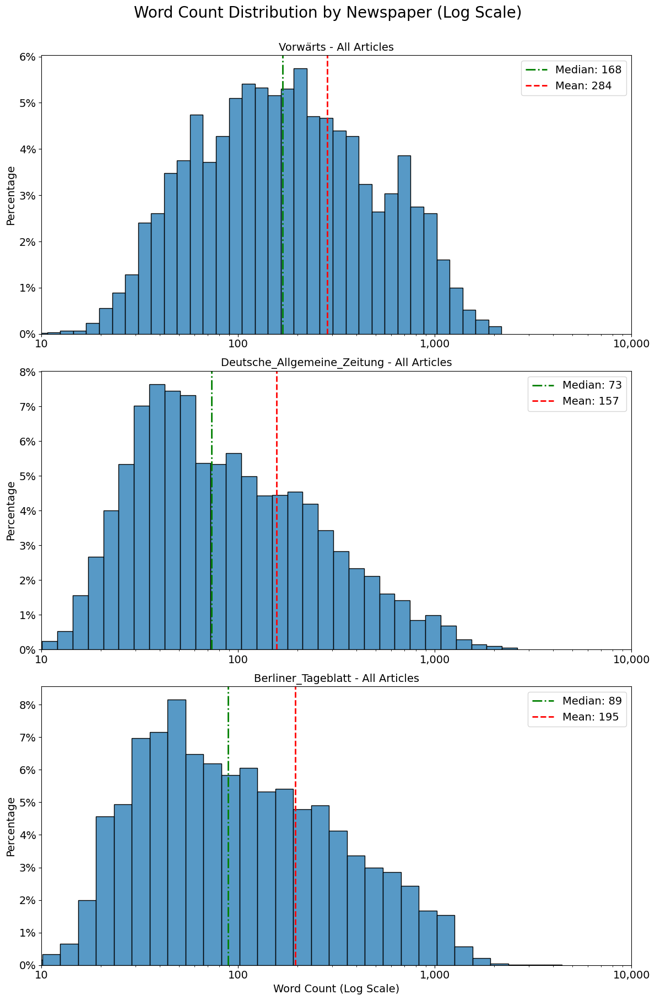
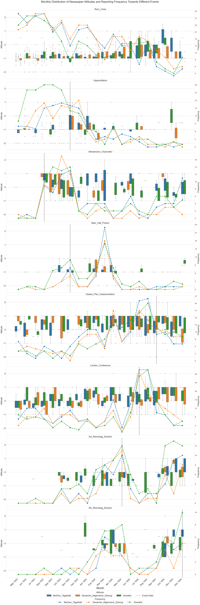

# The Influence of Media on Weimar Republic Politics: Analyzing the Reporting Trends of Major Newspapers in the mid-1920s

**Abstract:** This study examines the influence of media on Weimar Republic politics by analyzing reporting trends of major newspapers in the mid-1920s, focusing on their coverage of key events and their role in shaping public opinion during a period of economic turmoil and political instability.

## Introduction

After World War I, Germany established the Weimar Republic in 1919, marking a bold attempt at democratic governance amidst Europe's tumultuous post-war landscape. While the Republic fostered political progress and cultural renaissance, it grappled with economic turmoil and deep-seated political divisions. Its constitution, remarkably progressive for its time, granted universal suffrage and employed proportional representation to ensure diverse political voices in government.

The period from 1923 to 1924 stands out as particularly crucial in Weimar history. Germany weathered intense economic and political storms during this time, with the media playing a pivotal role in shaping public perception of these challenges. This research delves into how newspapers influenced political opinions and contributed to the widening societal rifts. We'll focus on three major newspapers representing distinct political leanings: the left-wing Vorwärts, the conservative Deutsche Allgemeine Zeitung, and the liberal Berliner Tageblatt. These papers were chosen for their significant readership and their representation of the main political currents of the time. By examining their coverage from May 1, 1923, to December 31, 1924, we aim to unravel the media's role during a period marked by hyperinflation, political violence, and contentious international negotiations over war reparations.

Our analysis will address the following research questions:

1. How did mainstream newspapers with different political orientations differ in their reporting of key events during 1923-1924, and what narratives did they construct?
2. To what extent did the coverage in these newspapers reflect or influence the political polarization of the Weimar Republic during this period?

This study employs a mixed-methods approach, combining quantitative content analysis with qualitative discourse analysis. Our methodology includes event co-occurrence analysis, sentiment analysis, and comparative analysis of reporting frequencies and attitudes across the three newspapers. This approach aims to uncover reporting trends, language framing, and potential biases, illuminating how these newspapers shaped public opinion during this crucial period of the Weimar Republic.

## Literature Review

The literature review for this study encompasses several key areas that provide a comprehensive foundation for our research on media bias and political polarization during the Weimar Republic. To establish the historical context, we begin with comprehensive analyses of the Weimar era. Möller's (2018) "Die Weimarer Republik: Demokratie in der Krise" and Mommsen's (2018) "Die verspielte Freiheit: Aufstieg und Untergang der Weimarer Republik" offer detailed examinations of the political, social, and economic factors that characterized this tumultuous period in German history. These works provide the necessary background for understanding the complex media landscape of the time.

Building on this historical foundation, we turn to studies specifically focused on the media environment of Weimar Germany. Fulda's (2009) "Press and Politics in the Weimar Republic" and Nguyen's (2022) analysis of the political power of the press during this era offer targeted insights into the role and influence of newspapers in shaping public opinion and political outcomes. These works are particularly valuable for our research, as they directly address the interplay between media and politics in our period of interest.

To situate our study within the broader context of media bias research, we draw upon Prior's (2013) work in the Annual Review of Political Science, which offers valuable insights into how the emergence of partisan media may contribute to political polarization. Complementing this perspective, Puglisi and Snyder Jr.'s (2015) overview of empirical studies on media bias in the Handbook of Media Economics provides a thorough framework for categorizing and measuring bias in media content.

To understand the mechanisms by which media influences public opinion, we incorporate communication theory into our analysis. Scheufele's (2000) revisitation of agenda-setting, priming, and framing in Mass Communication & Society provides crucial insights into the cognitive effects of political communication. These concepts are instrumental in analyzing how Weimar-era newspapers may have shaped public discourse through their selection and presentation of issues.

Finally, our methodological approach is informed by recent advancements in digital humanities and historical media analysis. Broersma and Harbers' (2020) exploration of machine learning techniques for studying long-term news transformations and Nicholson's (2013) discussion of the methodological possibilities offered by digital newspaper archives provide innovative frameworks for analyzing historical media content. These approaches allow us to leverage digital tools while maintaining a critical awareness of their limitations and the need for algorithmic transparency in historical research.

By synthesizing insights from historical analysis, media studies, communication theory, and digital humanities, this literature review provides a robust foundation for our investigation into media bias and political polarization during the Weimar Republic. This multifaceted approach positions us to conduct a nuanced examination of how newspapers may have influenced public opinion and political dynamics in this critical period of German history.

## Data Source

### 1. Newspaper Selection

The Weimar Republic era in Germany was characterized by a highly developed and diverse newspaper media landscape. During this period, Germany boasted hundreds of newspapers covering a wide spectrum of political and social viewpoints. From national broadsheets to local papers, and from party organs to independent publications, newspapers served as the primary channel for public information and opinion formation. This media environment not only reflected the freedom of speech and democratic atmosphere of the Weimar Republic but also provided a crucial platform for political debate and social discussion.

For our research, we have selected three representative newspapers that not only had significant circulation and broad influence but also represented the main political tendencies in German society at the time:

- **Berliner Tageblatt**:
    - Political orientation: Liberal-leaning, center-left stance
    - Readership: Primarily urban intellectuals, liberals, and progressives
- **Deutsche Allgemeine Zeitung**:
    - Political orientation: Center-right, supporting nationalism and conservative views
    - Readership: Mainly middle class, business people, and conservative intellectuals
- **Vorwärts**:
    - Political orientation: Official newspaper of the Social Democratic Party, left-wing stance
    - Readership: Primarily working class, socialist supporters, and trade union members

The diverse political orientations and target readerships of these three newspapers reflect the pluralism and broad political spectrum of German society during this period. 

|  |  |   |
| --- | --- | --- |


### 2. Time Period Selection

The Weimar Republic existed from 1919 to 1933, a brief but transformative period in German history. Our research focuses on the years 1923-1924, a crucial period for studying the Weimar Republic due to several significant factors:

- **Economic Crisis and Hyperinflation:** This period witnessed severe economic crisis and hyperinflation, profoundly impacting all social strata.
- **Political Instability and Rise of Extremism:** Economic turmoil exacerbated political instability, fostering the rise of far-right and far-left forces, setting the stage for later political transformations.
- **Shifting International Relations:** This era saw changes in Germany's relationships with other nations, particularly regarding war reparations discussions with the Allied powers.
- **Social Transformation:** Economic hardship catalyzed changes in social structures, affecting lifestyles and societal attitudes across different classes.

Our study focuses on the following key events:

```markdown
- Ruhr Crisis: "French and Belgian troops occupy the Ruhr area."
- Hyperinflation: "German hyperinflation reaches its peak."
- Stresemann Chancellor: "Gustav Stresemann becomes German Chancellor."
- Beer Hall Putsch: "Hitler's failed coup attempt in Munich."
- Dawes Plan Implementation: "Implementation of the Dawes Plan to stabilize the German economy."
- London Conference: "International conference for the adoption of the Dawes Plan."
- 3rd Reichstag Election: "Third Reichstag election of the Weimar Republic."
- 4th Reichstag Election: "Fourth Reichstag election of the Weimar Republic."
```

By examining newspapers from this period, we can gain insight into how various segments of German society perceived and reacted to these major events and changes, providing valuable primary source material for understanding the historical development of the Weimar Republic.

### 3. Data Collection

Our research project has amassed an extensive collection of front pages from three major daily newspapers: Vorwärts, Deutsche Allgemeine Zeitung, and Berliner Tageblatt. This comprehensive dataset spans from May 1, 1923, to December 31, 1924, a critical period in the Weimar Republic's history. The collection comprises 2,968 front pages in total, with 1,056 from Vorwärts, 891 from Deutsche Allgemeine Zeitung, and 1,021 from Berliner Tageblatt.

It is important to note that German newspapers of this era typically published multiple editions daily, including morning, afternoon, and evening issues. This practice provides a nuanced view of how news and opinions evolved throughout each day. The distribution of these front pages across the three newspapers and their various daily editions is illustrated in the figure below.



## Methodology

### 1. Data Preprocessing

The collected articles were in German text format, with continuous text. However, a typical newspaper front page usually contains multiple articles. To address this, we utilized the GPT-4-mini language model to segment the text into distinct articles.

The prompt we employed for this task is detailed below.

```markdown
system = """
You are an expert in analyzing German newspaper texts. Your task is to precisely divide the given text from a newspaper's front page into individual articles and extract relevant information. Please note that this is exclusively the content of the first page. Follow these expanded guidelines:

1. Edition Information:
   - Identify the edition (morning, midday, or evening edition) from the header of the front page.
   - Ignore other information such as newspaper name, printing details, or advertising.

2. Article Division:
   - Divide the main text into separate articles.
   - Pay attention to clear separators such as headlines, author names, date information, or topic changes.

3. Topic and Content:
   - Identify the main topic of each article on the front page.
   - Capture the main content, staying close to the original text.
   - Note that front page articles are often shorter and more concise.

4. Word Count:
   - Count the words of each article precisely (without spaces and punctuation).
   - Consider German special characters and compound words.

5. Output Format:
   {
     "edition": "Morning edition|Midday edition|Evening edition",
     "articles": [
       {
         "title": "Main topic of the article",
         "content": "Full article content on the front page",
         "wordCount": Number of words, 
       },
       // ... more articles from the front page
     ]
   }

Please ensure that the integrity and coherence of the original articles are maintained. For complex or ambiguous cases, provide a brief explanation of your decision.
"""

user = """
Please analyze the following German newspaper text from the front page according to the given guidelines. Note that this is only the content of the first page. Pay particular attention to difficult separations and clearly mark uncertain areas:

Front page text: {frontpage_txt}"""
```

We analyzed the distribution of article counts on the front pages of each newspaper. The figure below illustrates this distribution for Vorwärts, Deutsche Allgemeine Zeitung, and Berliner Tageblatt, with median article counts of 9, 13, and 10 respectively.

These figures provide insights into each newspaper's editorial approach:

- **Vorwärts (9 articles):** As the Social Democratic Party's official newspaper, it focused on fewer, likely more in-depth articles on key political issues.
- **Deutsche Allgemeine Zeitung (13 articles):** This center-right publication covered a broader range of topics, catering to a diverse middle-class readership.
- **Berliner Tageblatt (10 articles):** This liberal-leaning newspaper balanced in-depth analysis with shorter news items, appealing to an urban, intellectual audience.

These variations reflect the diverse political landscape and readership of the Weimar Republic, showing how each newspaper tailored its content to its target audience.



### 2. Information Extraction

For the subsequent analysis of each article's content, we employed GPT-4-mini to extract event-related information, including event identification, relevance analysis, and attitude assessment. The prompt utilized for this information extraction process is detailed below:

```markdown
system = """
You are an AI assistant specializing in the analysis of German newspaper articles from the early 1920s. Your task is to identify specific historical events, quantitatively assess their relevance and the article's attitude towards them.

user = """
List of historical events:
- Ruhr_Crisis: "French and Belgian troops occupy the Ruhr area."
- Hyperinflation: "German hyperinflation reaches its peak."
- Stresemann_Chancellor: "Gustav Stresemann becomes German Chancellor."
- Beer_Hall_Putsch: "Hitler's failed coup attempt in Munich."
- Dawes_Plan_Implementation: "Implementation of the Dawes Plan to stabilize the German economy."
- London_Conference: "International conference for the adoption of the Dawes Plan."
- 3rd_Reichstag_Election: "Third Reichstag election of the Weimar Republic."
- 4th_Reichstag_Election: "Fourth Reichstag election of the Weimar Republic."

Please conduct a thorough analysis of the following German newspaper article:

1. Event identification and analysis:
  a) Identify the historical events mentioned in the article (refer to the provided list).
  b) Evaluate the relevance of each event on a scale of 1-5 according to the following criteria:
     5: Main event, central theme of the article
     4: Important related event with significant influence on the topic
     3: Moderately relevant event with clear connection, but not central
     2: Slightly relevant event, mentioned but with weak connection
     1: Background event, mentioned only as contextual information
2. Attitude assessment:
  Evaluate the overall attitude of the article towards the main events using the following quantitative scale:
     -2 = very negative
     -1 = negative
      0 = neutral
      1 = positive
      2 = very positive
     0.5 or -0.5 = mixed (depending on tendency)
  
Please provide your analysis results in the following JSON format:

{
  "events": [
    {
      "event": "Event name",
      "relevance": number,
      "attitude": number
    }
  ],
}

Article: {content}
"""
```

Our analysis revealed that articles often covered multiple events simultaneously. To capture these complex relationships, we employed a co-occurrence matrix to analyze the frequency with which different events were reported together.

The co-occurrence matrix analysis of event coverage in Vorwärts, Deutsche Allgemeine Zeitung, and Berliner Tageblatt unveiled distinct editorial priorities and approaches in reporting on the Weimar Republic's intricate political and economic landscape. Each newspaper exhibited unique coverage patterns, reflecting their ideological orientations and target audiences.

Vorwärts, primarily concerned with economic crises and their impact on the working class, frequently drew connections between domestic hardships and international conferences, emphasizing the necessity for economic aid. Deutsche Allgemeine Zeitung adopted a more policy-centric approach, focusing on international economic and diplomatic events, particularly the Dawes Plan and London Conference, while addressing domestic issues from a broader perspective. Berliner Tageblatt distinguished itself through its emphasis on international cooperation, often linking the implementation of the Dawes Plan with the London Conference, while also exploring the interplay between international diplomacy and domestic economic challenges.

These variations in coverage highlight the diverse political landscape of the Weimar Republic and the newspapers' respective editorial positions during this critical period. Each publication offered readers a unique perspective through which to interpret the complex economic and political developments of the time, contributing to a rich and varied media landscape.



The figure shows the distribution of article lengths across eight relevant event reports. Vorwärts, characterized by relatively lengthy articles, tends to provide in-depth analysis and comprehensive discussions of events, catering to readers seeking detailed information. In contrast, Deutsche Allgemeine Zeitung features concise articles that deliver succinct news reports, primarily offering overview-style content suitable for readers who prefer quick information acquisition. Berliner Tageblatt strikes a balance with moderate article lengths, combining both brief reports and moderate analysis, thus accommodating readers who desire equilibrium between information quantity and depth.



Given that excessively short articles often lack sufficient analysis and contextual information, our subsequent analysis will focus exclusively on articles exceeding 250 words in length. This threshold ensures a more robust examination of the content and its implications. The table shows the number of articles we selected and the total number of articles in the original dataset.

| Newspaper Name | Selected Articles | Total Articles in Original Dataset |
| --- | --- | --- |
| Vorwärts | 943 | 5523 |
| Deutsche Allgemeine Zeitung | 611 | 8452 |
| Berliner Tageblatt | 796 | 7597 |
| Total | 2350 | 21572 |

### 3. Reporting Attitudes and Frequencies

The following figure illustrates the reporting attitudes and frequencies of three prominent newspapers regarding eight major political events. This data visualization employs two distinct graphical representations:

1. **Attitude:** Depicted through box plots, these graphs showcase the monthly attitudes of each newspaper towards various political events. Positive values indicate support, negative values denote opposition, while zero represents a neutral stance or lack of clear position.
2. **Frequency:** Represented by line graphs, these charts display the monthly reporting frequency of each newspaper on political events. Peaks in frequency signify periods of extensive coverage by these publications.

An analysis of the data reveals significant disparities in both attitude and reporting frequency among three major newspapers—Berliner Tageblatt, Deutsche Allgemeine Zeitung, and Vorwärts—concerning a series of political events from 1923 to 1924. The interrelationships between these events notably influenced media responses, shaping the complex landscape of public discourse during this tumultuous period of the Weimar Republic.

The Ruhr crisis, precipitated by the Franco-Belgian occupation, elicited diverse reactions from the German press. Berliner Tageblatt and Vorwärts adopted markedly negative stances, emphasizing the threat to national sovereignty, while Deutsche Allgemeine Zeitung maintained a more moderate position, potentially reflecting support for diplomatic resolutions. The heightened reporting frequency during this period underscores the media's intense focus on the crisis, particularly during its most acute phases.

Concurrently, the hyperinflation crisis reached its zenith in late 1923 and early 1924, garnering unanimous negative coverage across all three newspapers. This economic turmoil not only threatened fiscal stability but also exacerbated social instability, as evidenced by the newspapers' concentrated reporting. The interconnectedness of the Ruhr crisis and hyperinflation became apparent in media narratives, with the economic blockade resulting from foreign occupation further intensifying inflationary pressures.

The tenure of Gustav Stresemann as Chancellor marked another point of divergence in media attitudes. Berliner Tageblatt and Deutsche Allgemeine Zeitung expressed support for Stresemann's ascension, particularly endorsing his economic stabilization and foreign policy initiatives. In contrast, the left-leaning Vorwärts adopted a more critical stance, particularly regarding Stresemann's conservative economic policies and cooperation with Western powers. The significant increase in reporting frequency during the latter half of 1923 reflects the perceived importance of this political transition.

Hitler's Beer Hall Putsch in November 1923 emerged as a critical juncture in Weimar Germany's political crisis. All three newspapers unanimously condemned the coup attempt, with Berliner Tageblatt and Vorwärts displaying particularly strong opposition. Vorwärts' vehement criticism underscored its staunch resistance to right-wing extremism. The event triggered a spike in reporting frequency, indicating widespread concern over this threat to democratic order, though coverage rapidly declined following the putsch's swift failure.

The implementation of the Dawes Plan in 1924 shifted media focus towards economic stabilization efforts. This international cooperative initiative to restore Germany's economic equilibrium garnered substantial support from Berliner Tageblatt and Deutsche Allgemeine Zeitung, which viewed it as an effective measure to alleviate Germany's economic crisis. Vorwärts, however, maintained a critical perspective, possibly due to perceived inadequacies in addressing working-class interests. The media's coverage of the Dawes Plan demonstrated clear continuity with earlier reporting on hyperinflation, reflecting the pressing need for international economic assistance.

The London Conference in July and August of the same year, a crucial step in internationalizing the Dawes Plan, received generally positive coverage from Berliner Tageblatt and Deutsche Allgemeine Zeitung. Vorwärts, however, maintained a more neutral to slightly negative stance, likely reflecting ongoing skepticism towards international capitalism. The spike in reporting frequency during these months highlighted the media's keen interest in this international summit.

The third and fourth Reichstag elections of May and December 1924, respectively, became focal points of media attention. The elections exposed further divergences in newspaper attitudes, with Berliner Tageblatt adopting a relatively neutral stance towards the results, while Vorwärts expressed clear negativity towards the rise of right-wing forces. The substantial increase in reporting frequency during these periods underscored the elections' significance in the socio-political landscape. These electoral events were intrinsically linked to preceding political developments, including Stresemann's policies, the progress of the Dawes Plan, and the rapid ascendancy of right-wing elements following the Beer Hall Putsch, rendering them crucial tests of the Weimar Republic's political stability.

In conclusion, the period from 1923 to 1924 was characterized by a complex interweaving of major political events, with the three newspapers exhibiting marked differences in attitudes and reporting frequencies. These variations reflected the diverse stances of media outlets within the intricate political and economic milieu of the time. Berliner Tageblatt represented a moderate, middle-class liberal perspective, while Deutsche Allgemeine Zeitung articulated the interests of conservative elites. Vorwärts, as the voice of the Social Democratic Party, consistently championed working-class interests and critiqued the expansion of right-wing and capitalist influences. These positions were not only evident in the coverage of individual events but also manifested in the continuity of reporting across interconnected issues, such as the Ruhr crisis and hyperinflation, the Dawes Plan and parliamentary elections, and the successive Reichstag elections. This interplay of events and media responses contributed to the formation of a multifaceted public opinion landscape during the Weimar era.




The analysis results align with two fundamental media theories: Agenda Setting and Framing. The varying frequencies of event coverage across the three newspapers demonstrate Agenda Setting, showing how these publications influenced which issues their readers considered important. Meanwhile, the diverse attitudes towards events like Stresemann's chancellorship or the Dawes Plan implementation exemplify Framing, illustrating how each newspaper's ideological perspective shaped the presentation of information, potentially influencing readers' interpretations of these events.

## Limitations and Challenges

- Difficulty in isolating the effect of newspaper bias from other socio-political factors influencing electoral outcomes
- Incomplete/damaged newspaper archives
- Only three newspapers were included, other newspapers, including tabloids, other elite newspapers, and mass newspapers, could be of potential influence (”Tabloid newspapers have an important influence on voters by disseminating political information through entertainment packages and inflammatory stories. The influence of traditional political newspapers has declined, but policymakers still overestimate their importance. “ according to *Press and Politics in the Weimar Republic*)
- Potential OCR errors in text extraction (despite the fact they are calibrated by LLMs)
- Considering the limitations of using LLMs, such as hallucination, in the research methodology.
- Endogeneity issues: Newspaper bias might be both a cause and effect of public opinion and electoral outcomes.

## Conclusion

This study on the influence of media on Weimar Republic politics during the mid-1920s reveals several key insights:

- Media bias played a significant role in shaping public opinion and political discourse during this tumultuous period.
- Different newspapers exhibited distinct editorial priorities and approaches in their coverage of major events, reflecting their ideological orientations and target audiences.
- The interconnectedness of political and economic events was evident in media narratives, with coverage of one issue often influencing the reporting of others.
- Variations in article length and reporting frequency across newspapers highlight the diverse media landscape of the Weimar Republic.
- The study demonstrates the complex relationship between media coverage, public opinion, and political outcomes in a nascent democracy.

While this research provides valuable insights into the media landscape of the Weimar Republic, it also underscores the need for further investigation into the long-term effects of media bias on democratic institutions and public discourse. Future studies could expand on this work by incorporating a broader range of media sources and employing more advanced analytical techniques to deepen our understanding of the intricate relationships between media, politics, and society in historical contexts.

## Reference

- Prior, Markus. "Media and political polarization." *Annual review of political science* 16.1 (2013): 101-127.
- Puglisi, Riccardo, and James M. Snyder Jr. "Empirical studies of media bias." *Handbook of media economics*. Vol. 1. North-Holland, 2015. 647-667.
- Scheufele, Dietram A. "Agenda-setting, priming, and framing revisited: Another look at cognitive effects of political communication." *Mass communication & society* 3, no. 2-3 (2000): 297-316.
- Möller, Horst. *Die Weimarer Republik: Demokratie in der Krise*. Piper ebooks, 2018.
- Mommsen, Hans. *Die verspielte Freiheit: Aufstieg und Untergang der Weimarer Republik*. Ullstein Buchverlage, 2018.
- Fulda, Bernhard. *Press and politics in the Weimar Republic*. Oxford University Press, USA, 2009.
- Nguyen, Bang Dinh. "Political power of the press in the Weimar Republic." *European Review of Economic History* 26, no. 4 (2022): 579-611.
- Broersma, Marcel, and Frank Harbers. "Exploring machine learning to study the long-term transformation of news: Digital newspaper archives, journalism history, and algorithmic transparency." *Journalism History and Digital Archives*. Routledge, 2020. 38-52.
- Nicholson, Bob. "The Digital Turn: Exploring the methodological possibilities of digital newspaper archives." *Media History* 19.1 (2013): 59-73.