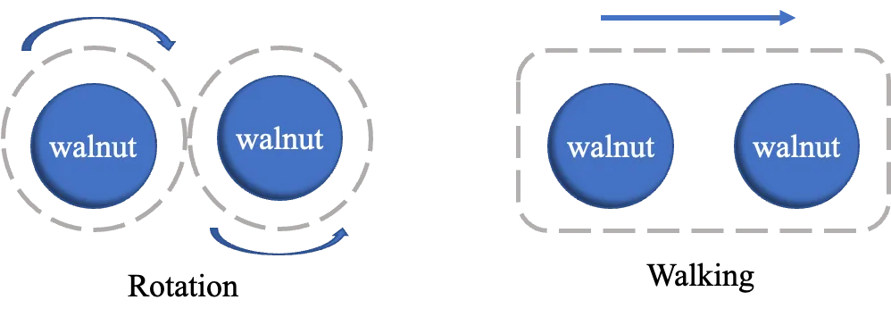
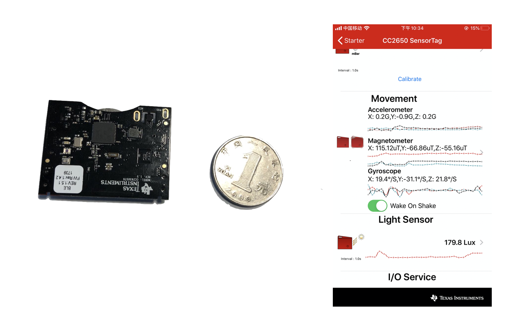
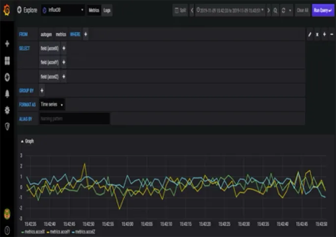
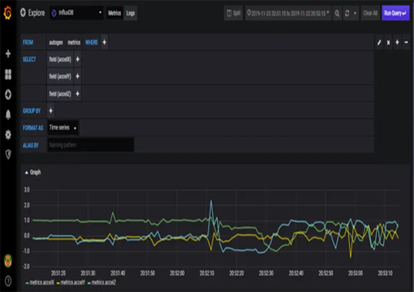
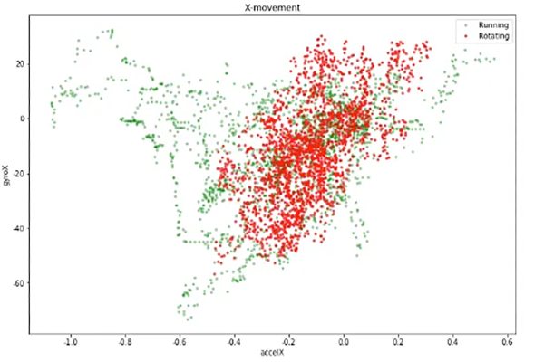
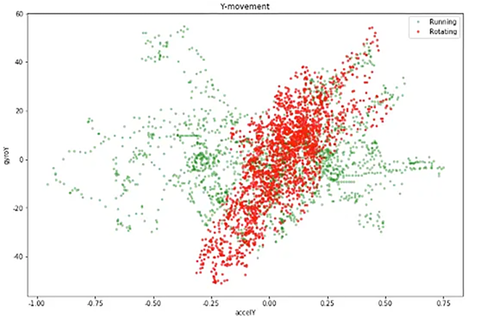
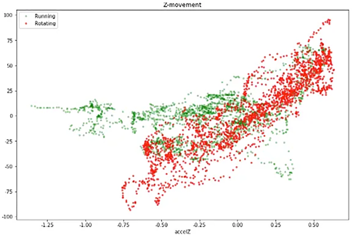

## Smart Walnut - An Early Prevention Device for Alzheimer's Disease**

### Abstract

The Smart Walnut is a high school science project exploring early Alzheimer's prevention. It combines basic medical knowledge with simple technology to address cognitive decline in the elderly. Our project aims to create a user-friendly tool for early detection of cognitive decline symptoms. Using basic sensors and data analysis, the Smart Walnut could offer a new approach to proactive health monitoring for at-risk elderly individuals.

### Research Background

As high school students, we were intrigued by the growing challenge of Alzheimer's disease in our aging society. China's elderly population (12% over 65) faces an increasing prevalence of Alzheimer's, affecting 5.5% of this age group [1]. Globally, the situation is equally concerning, with 50 million people affected and potential tripling by 2050.

We learned that despite annual treatment costs exceeding $1 trillion worldwide, there's still no definitive cure. This realization sparked our interest in exploring preventative measures.

Our project was inspired by a fascinating area of research: the potential cognitive benefits of manipulating walnuts, a popular pastime among the elderly. Recent studies suggest this simple activity might have brain protective effects, potentially helping prevent Alzheimer's and slow its progression [2].

As young researchers, we were excited by the possibility of non-pharmacological interventions for age-related cognitive decline. This led us to develop our "Smart Walnut" project, aiming to combine this traditional activity with modern technology to create an innovative approach to Alzheimer's prevention.

### Research Inspiration

Inspired by the dual nature of walnuts - both as a traditional hand-exercising tool and a renowned "brain-boosting superfood" - we designed a device that mimics the shape of a walnut. This approach combines the cognitive benefits of manipulating the object with the symbolic representation of its nutritional value for brain health.

### Research Question

We embedded a sensor chip in the walnut mold, using a three-axis accelerometer and gyroscope (angular accelerometer) to collect motion data. When elderly people carry the Smart Walnut, both rotating and walking cause changes in the motion sensor data. Our research question is: How can we efficiently distinguish between these two different states of walnut rotation and walking?

### Proof of Concept Design

The walnut shell is 3D printed, with a spherical plastic substitute used for initial testing. The sensor component is based on the SensorTag integrated development kit produced by TI. This sensor component mainly includes a microprocessor, a nine-axis motion sensor, LED indicators, a start button, and a data interface. The Smart Walnut primarily uses a three-axis accelerometer and a three-axis gyroscope. The smartphone application Starter communicates with SensorTag via Bluetooth, collecting data from both sensors and uploading it to the cloud. By computing and analyzing these two types of sensor data, we can identify the direction and speed of the Smart Walnut's movement.

The graphical representations illustrate data collection for both rotation and walking states, , highlighting distinct patterns and variations between these two modes of movement.

|  | |
| --- | --- |
| 
Rotation state
 | 
Walking state
 |

We propose a hypothesis that the acceleration measurements in the X, Y, and Z axes of the accelerometer are perpendicular to each other, while the angular accelerations in the X, Y, and Z axes correspond to their respective accelerations. During rotation, since there are two walnuts, they exhibit both self-rotation and revolution characteristics. The accelerometer and gyroscope data corresponding to the X, Y, and Z axes show consistent motion trends. When the walnut is rotating, the Z-axis acceleration and angular acceleration trends are consistent and show some periodicity. However, in step-counting mode, acceleration and rotational acceleration are only produced in one motion axis direction, while other axes show relatively small motion amplitudes, inconsistent motion trends, and produce smaller accelerations and angular accelerations. Therefore, we can classify based on these two data characteristics.

### Experimental Data and Analysis Results

Our experiment involved a 65-year-old participant. Using the Smart Walnut, we collected 12,886 data points, including 6,582 in rotation state and 6,304 in walking state. Each data point contained 3 measurements each for acceleration and gyroscope data on the X, Y, and Z axes. We used 80% of the data as a training set and 20% as a test set. We designed two approaches: one without any processing, directly using existing classification models to distinguish between the two states. We examined three common machine learning algorithms. Due to the mathematical complexity of these algorithms, we treated them as black-box models, focusing only on their performance on the 20% test set, which showed an accuracy of around 70%.

|  |  |  |
| --- | --- | --- |
| 
X Direction
 | 
Y Direction
 | 
Z Direction
 |

Scatter plot of acceleration vs. angular acceleration in the X, Y, and Z direction

We created scatter plots of acceleration vs. angular acceleration for the X, Y, and Z directions. Taking the Z direction as an example, the x-axis represents acceleration, and the y-axis represents angular acceleration. Green dots indicate the walking state, while red dots represent the rotation state. It's challenging to distinguish these two states using a simple classifier. However, we observed that during walnut rotation, due to the presence of both rotation and revolution, there's a clear correlation between acceleration and angular acceleration in the Z direction.

We designed a correlation coefficient to express the degree of association between acceleration and angular acceleration in the Z direction, and plotted it as a bar graph.

Compared to the previous graph, the walking and rotation states are easier to distinguish. Using the same three classification methods as before, we found that after applying this correlation transformation, the accuracy improved by about 20%.

| **Method Type** | **Method 1** | **Method 2** | **Method 3** |
| --- | --- | --- | --- |
| No processing | 67% | 77% | 74% |
| Correlation transformation | 88% | 95% | 89% |

Table: Accuracy Comparison

### Conclusion

We designed a smart device called the Smart Walnut to help Alzheimer's patients. By collecting and analyzing data on step frequency, walking patterns, and posture using big data analysis methods, we aim to detect early symptoms of Alzheimer's disease, helping patients with early prevention and treatment. Our next steps include improving the device's wearability and incorporating more sensors for multi-dimensional data collection to increase detection accuracy.

### References

[1] Huang Y, Wang Y, Wang H, et al. Prevalence of mental disorders in China: a cross-sectional epidemiological study. The Lancet Psychiatry. 2019, 6(3): 211-224.

[2] Xu A, Chen X, Wang D. Biological mechanisms and drug interventions for Alzheimer's disease. Journal of Peking University (Medical Edition), 2016, 48(3): 417-425.
